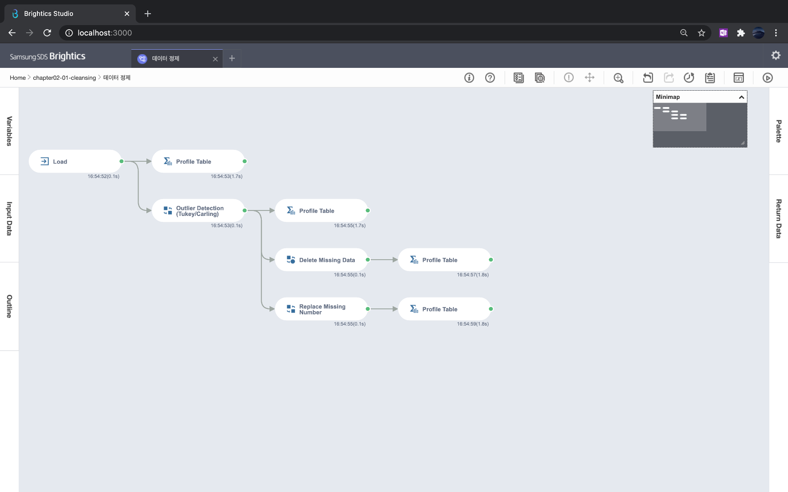
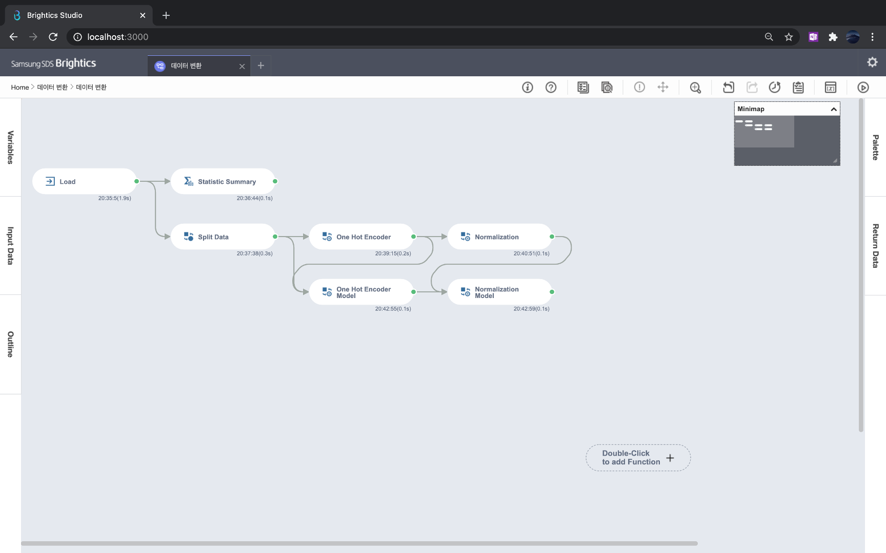

# 2장 데이터 전처리

### [1. 데이터 정제](./notes/데이터%20정제.md)
- 결측값의 종류: MCAR, MAR, MNAR
- 이상값을 판단하는 방법으로 Tukey 방법
- 결측값과 이상값은 분석가의 판단에 따라 제거 및 대체

[실습파일: 데이터 정제](./데이터%20정제.json)

### [2. 데이터 변환](./notes/데이터%20변환.md)
- 결측값의 종류: MCAR, MAR, MNAR
- 이상값을 판단하는 방법으로 Tukey 방법
- 결측값과 이상값은 분석가의 판단에 따라 제거 및 대체

[실습파일: 데이터 변환](./데이터%20변환.json)
