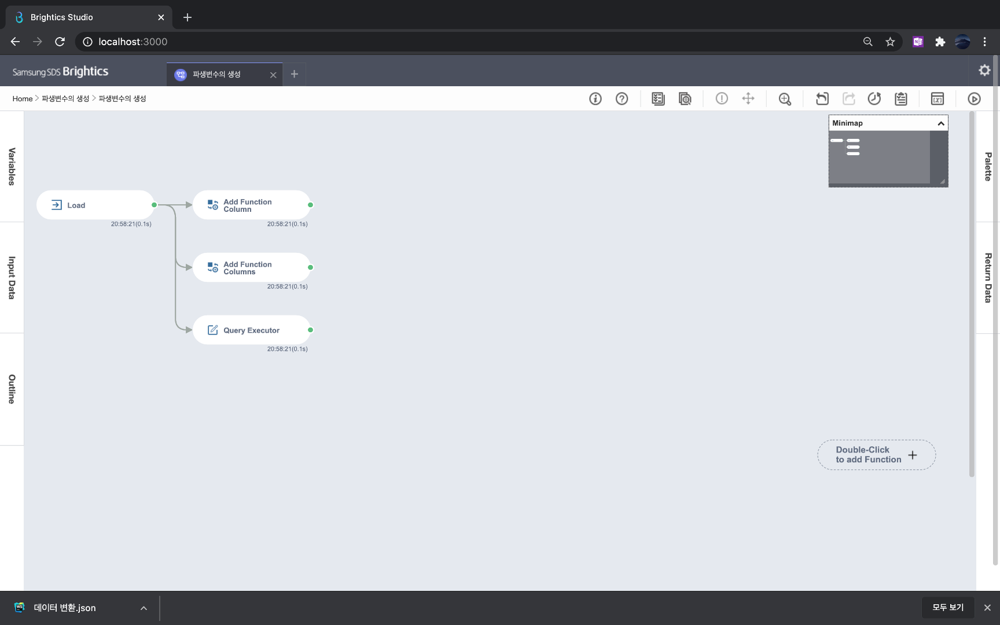
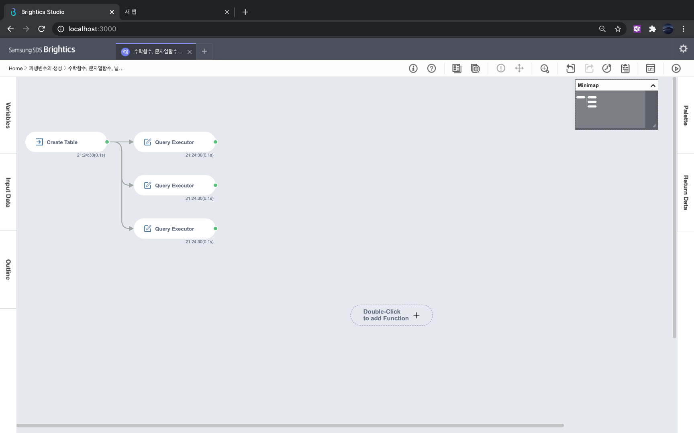
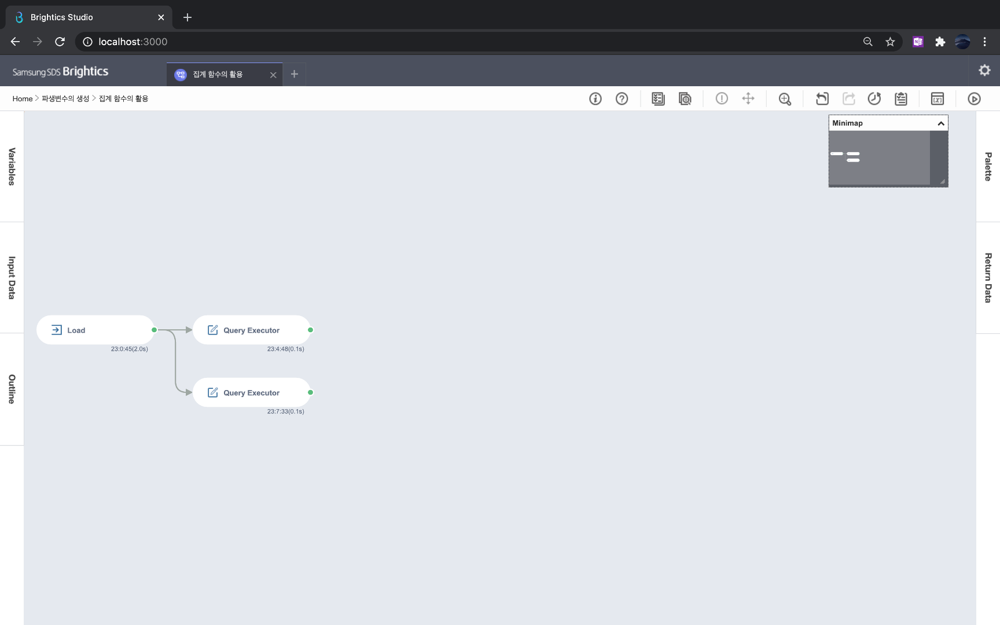
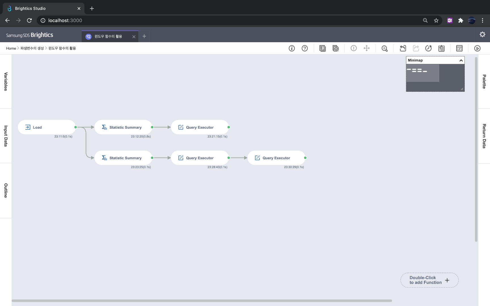

# 2장 데이터 전처리

### [1. 데이터 정제](./notes/데이터%20정제.md)
- 결측값의 종류: MCAR, MAR, MNAR
- 이상값을 판단하는 방법으로 Tukey 방법
- 결측값과 이상값은 분석가의 판단에 따라 제거 및 대체

[실습파일: 데이터 정제](./데이터%20정제.json)

### [2. 데이터 변환](./notes/데이터%20변환.md)
- 연속형 변수 변환: Min-Max Normalization과 Standardization
- 범주형 변수 변환: One Hot Encoding
- 시계열 변수 변환: Lead와 Lag

[실습파일: 데이터 변환](./데이터%20변환.json)

### [3. 파생변수의 생성](./notes/파생변수의%20생성.md)
- Add Function Column(s)와 Query Executor로 파생변수 생성
- 숫자, 문자, 날짜를 위한 함수 | 집계 함수 | 윈도우 함수

[실습파일: 파생변수의 생성](./파생변수의%20생성.json)

[실습파일: 집계 함수의 활용](./함수의%20활용.json)

[실습파일: 집계 함수의 활용](./집계%20함수의%20활용.json)

[실습파일: 윈도우 함수의 활용](./윈도우%20함수의%20활용.json)

### [4. 행과 열의 핸들링과 정렬](./notes/행과%20열의%20핸들링과%20정렬.md)
- Select Column: 열 관리
- Filter: 조건에 맞는 행 관리
- Sort: 정렬

### [5. 데이터 결합 및 형태 변환](./notes/데이터%20결합%20및%20형태%20변환.md)
- 결합을 위한 함수: Join, Bind Row Column
- 형태 변환을 위한 함수: Pivot, Unpivot
