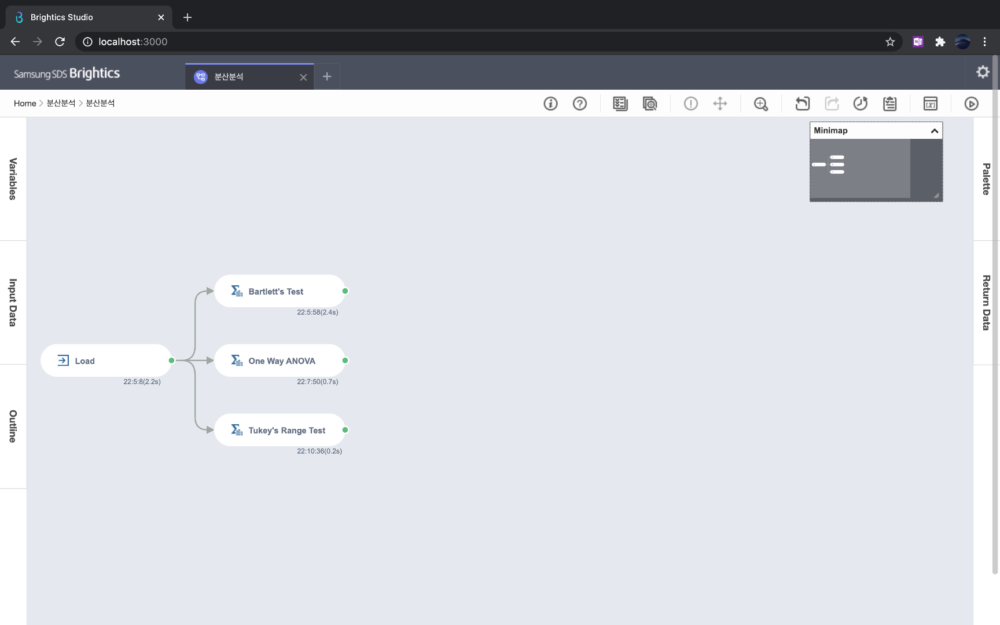
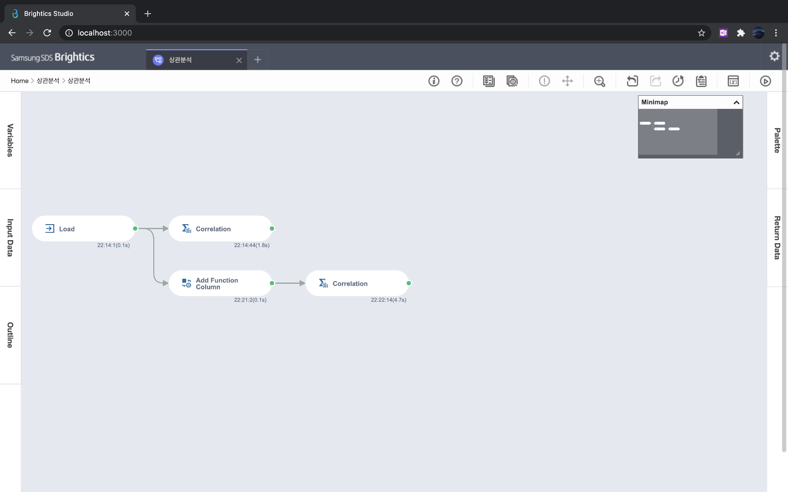
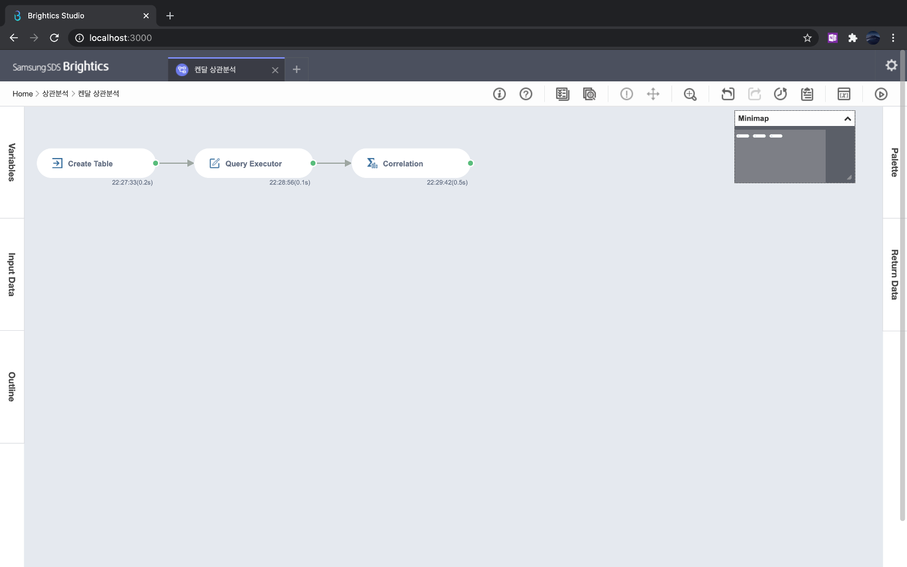
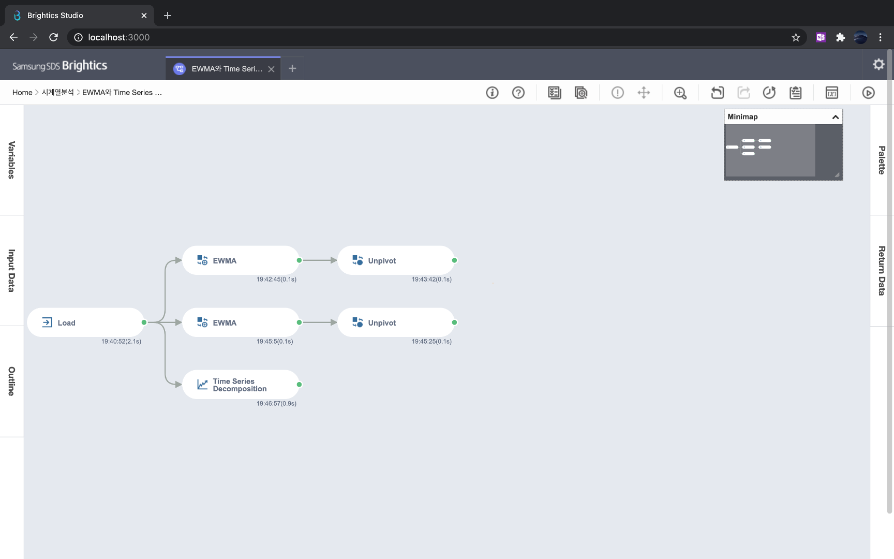
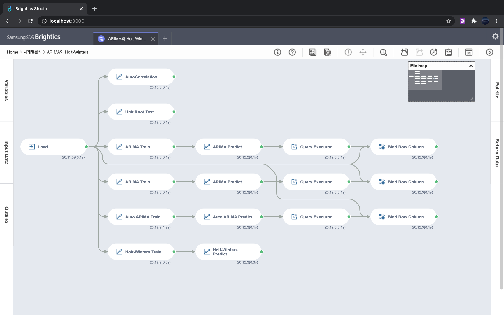

# 3장 통계분석

### [1. 확률 변수와 확률 분포](./notes/확률%20변수와%20확률%20분포.md)
- 확률변수는 표본공간애서의 실수값 함수
- 변수가 취하는 값에 따라서 이산확률변수와 연속확률변수로 구분하며, 각각 확률질량함수와 확률밀도함수를 정의한다.
- 확률 분포
  - 이산확률분포: 균등분포, 베르누이 분포, 이항 분포, 포아송 분포
  - 연속확률분포: 균등분포, 정규분포, t 분포, 카이제곱 분포, F 분포
- 중심극한정리는 모집단이 어떠한 분포를 따르든 샘플사이즈가 큰 표본의 표본 평균은 정규분포를 따른다는 것을 의미한다.
- 히스토그램과 QQ 플롯으로 확률 분포를 시각화하여서 분석할 수 있다.

### [2. 팀색적 데이터 분석](./notes/탐색적%20데이터%20분석.md)
- 위치 통계량 - 대표값 파악하기: 평균, 중앙값, 최빈값, 사분위수
- 변위 통계량 - 흩어짐 파악하기: 범위, 사분위수, 분산과 표준편차, 변동계수
- 모양 통계량 - 모양 파악하기: 왜도와 첨도
- 차트를 통해 수치형 데이터와 범주형 데이터 분석

### [3. 추정과 검정](./notes/추정과%20검정.md)
1. 추정: 표본의 통계량으로 모집단의 모수를 파악하는 과정
   - 추정은 점추정과 구간추정으로 구분한다.
   - 점추정은 모수를 하나의 값으로 추정하며, 최대가능도추정으로 이어진다.
   - 구간추정은 모수가 있을 신뢰구간을 추정하며, 중심극한정리를 활용한다.
2. 검정: 표본을 통해 세운 가설이 합당한지 파악하는 과정
   - 검정의 과정: 가설 수립 → 검정통계량(t값, F값, χ2 값)을 산출한다 → p-value를 산출한다 → p-value가 유의수준 ɑ(=0.05) 보다 작으면 귀무가설을 기각한다.
     - p-value는 귀무가설이 참일 때 검정통계량보다 더 특이한 값이 나올 확률이다.
     - 유의수준은 1종 오류(귀무가설이 진짜임에도 불구하고 기각되는 오류)를 허용하는 정도로서 5%(=0.05)를 보통 설정한다.
   - 검정은 t 검정, 카이제곱검정이 있다.
     - t 검정은 단일표본 t 검정, 짝지어진 t 검정, 독립표본 t 검정으로 구분한다.
     1. 단일표본 t 검정 - 표본의 평균이 알려진 모수 평균값인지 검정
     2. 짝지어진 t 검정 - 특정한 기준(시간)으로 짝지어진 두 표본의 차이의 평균이 알려진 모수 평균값인지 검정
     3. 독립표본 t 검정 - 두 그룹에 평균이 차이가 나는지 검정
     -  카이제곱 검정은 두 범주형 변수의 독립성을 검정한다.

|[실습파일: 단일표본 t 검정](./단일표본%20t%20검정.json)|[실습파일: 짝지어진 t 검정](./짝지어진%20t-검정.json)|[실습파일: 독립표본 t 검정](./독립표본%20t%20겁정.json)|[실습파일: 카이제곱 검정](./카이제곱%20검정.json)|
|-|-|-|-|
|||||

### [4. 분산분석](./notes/분산분석.md)
- ANOVA 분석은 그룹 간의 평균 차이를 분산을 활용하여서 분석
- 일원분산분석은 하나의 범주형 변수에 대해서, 이원분산분석은 두개의 범주형 변수에 대해서 검정한다
- 분산분석을 통해 귀무가설을 기각하면, Duncan, Tukey, Scheffe 방법으로 그룹간 평균 비교

|[실습파일: 분산분석](./분산분석.json)|
|-|
||

### [5. 상관분석](./notes/상관분석.md)
- 상관계수의 종류로 피어슨 상관계수, 스피어만 상관계수, 켄달 상관계수가 있다

|[실습파일: 상관분석](./상관분석.json)|[실습파일: 켄달 상관분석](./켄달%20상관분석.json)|
|-|-|
|||

### [6. 시계열분석](./notes/시계열분석.md)
- 평활법의 종류
  1. 이동평균평활법 - 단순 평균
  2. 지수이동평균평활법(EWMA) - 가중 평균
  3. 단순지수평활법 - EWMA와 동일
  4. 이중지수평활법 - 자료평활 + 추세평활
  5. 삼중지수평활법 - 자료평활 + 추세평활 + 계절변화평활
- 분해법
  1. Additive Model - Z = T(rend) + C(ycle) + S(eason) + R(esidual)
  2. Multiplicative Model - Z = T(rend) · C(ycle) · S(eason) · R(esidual)
  - 진폭이 일정한 경우 Additive Model을 사용하고, 진폭이 점차 증가하는 경우 Multiplicative Model를 사용한다
- ACF와 PACF로 확률적 시계열 모형 파악
  - ACF는 현재 시점과 이전 시점의 상관관계를 파악
  - PACF는 현재 시점과 이전 시점의 상관관계를 파악하되, 두 시점 이외의 종속성을 배제하고 순수하게 두 시점의 상관관계를 파악
- 확률적 시계열 모형은 시계열 데이터가 확률적 구조에서 나오는 경우
  - 정상성 여부에 따라서 정상 시계열 자료와 비정상 시계열 자료로 구분
  - 정상성: 시간이 흐르지만 확률 구조가 변하지 않는다. 시간에 따른 평균, 분산, 공분산의 변화로 파악(약한 정상성)
- 주요 시계열 확률 모형
  1. 백색 소음 과정(white noise process) - 랜덤하게 데이터 생성
  2. 확률 보행 과정(random walk process) - 이전 시점에 관측값에다가 랜덤한 잔차 추가
  3. 이동 평균 과정(moving average process) - 이전 시점의 에러가 현재 시점의 관측값을 결정
  4. 자기 회귀 과정(auto regressive process) - 이전 시점의 관측값이 현재 시점의 관측값을 결정
  5. 자기 회귀 이동 평균 과정(ARMA, auto regressive moving average process) - AR + MA. AR과 MA의 쌍대성을 활용
  6. 자기 회귀 누적 이동 평균 과정(ARIMA) - 비정상정 모델의 확률적 추세를 파악하기 위한 차분(differencing) 도입한 모델
- 시계열 데이터의 거리
  1. 유클리디언 거리
  2. 상관 유사도
  3. Dynamic Time Warping
  4. SAX(Symbolic Aggregated Approximation)

|[실습파일: EWMA와 Time Series Decomposition](./EWMA와%20Time%20Series%20Decomposition.json)|[실습파일: ARIMA와 Holt-Winters](./ARIMA와%20Holt-Winters.json)|
|-|-|
|||
