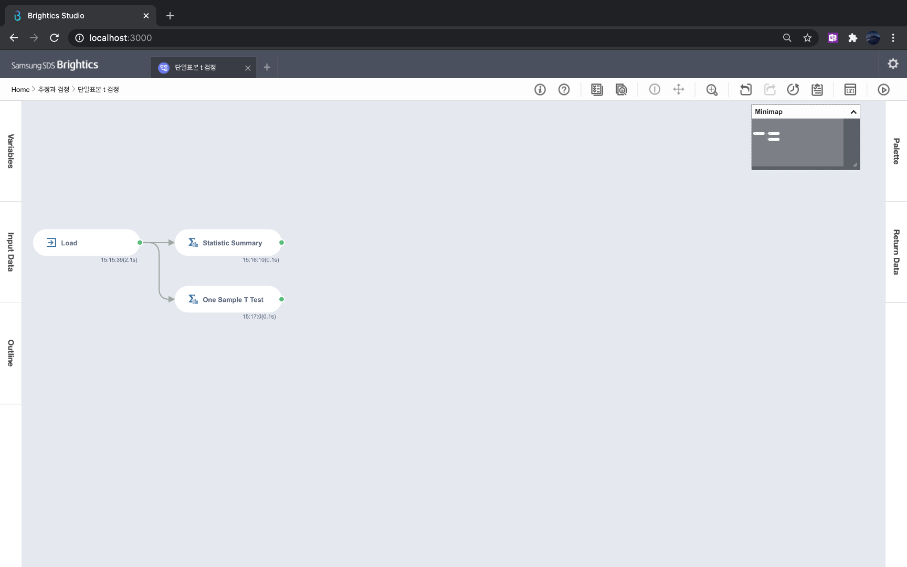
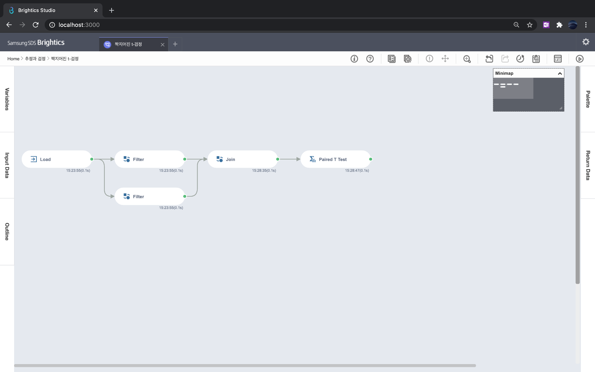
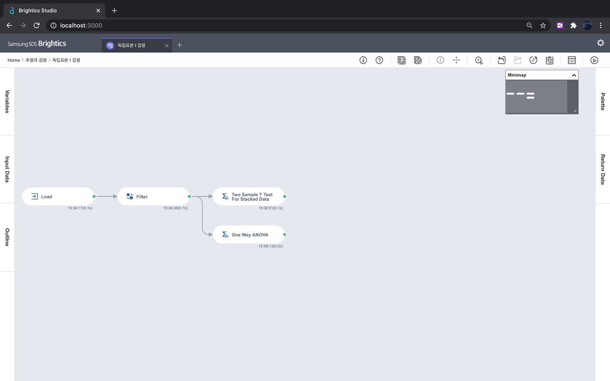
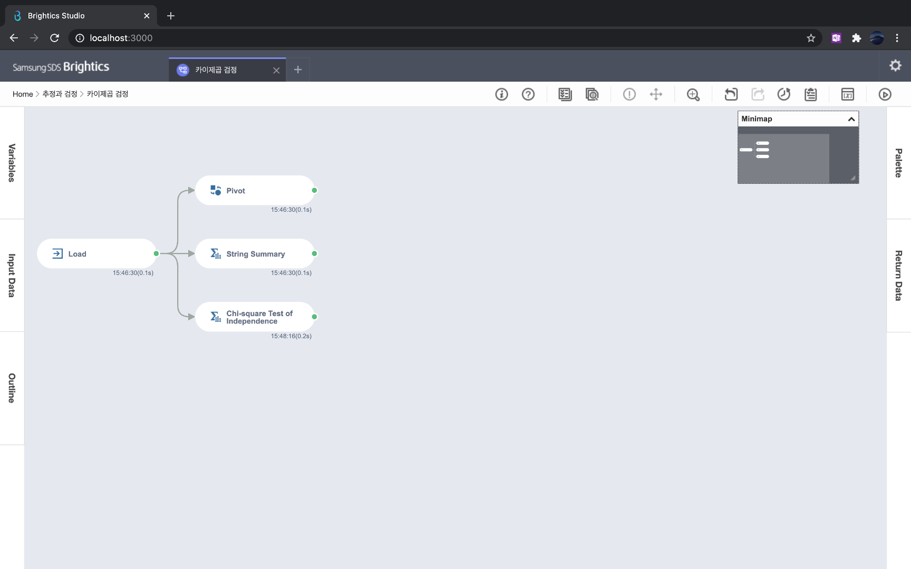

# 3장 통계분석

### [1. 확률 변수와 확률 분포](./notes/확률%20변수와%20확률%20분포.md)
- 확률변수는 표본공간애서의 실수값 함수
- 변수가 취하는 값에 따라서 이산확률변수와 연속확률변수로 구분하며, 각각 확률질량함수와 확률밀도함수를 정의한다.
- 확률 분포
  - 이산확률분포: 균등분포, 베르누이 분포, 이항 분포, 포아송 분포
  - 연속확률분포: 균등분포, 정규분포, t 분포, 카이제곱 분포, F 분포
- 중심극한정리는 모집단이 어떠한 분포를 따르든 샘플사이즈가 큰 표본의 표본 평균은 정규분포를 따른다는 것을 의미한다.
- 히스토그램과 QQ 플롯으로 확률 분포를 시각화하여서 분석할 수 있다.

### [2. 팀색적 데이터 분석](./notes/탐색적%20데이터%20분석.md)
- 위치 통계량 - 대표값 파악하기: 평균, 중앙값, 최빈값, 사분위수
- 변위 통계량 - 흩어짐 파악하기: 범위, 사분위수, 분산과 표준편차, 변동계수
- 모양 통계량 - 모양 파악하기: 왜도와 첨도
- 차트를 통해 수치형 데이터와 범주형 데이터 분석

### [3. 추정과 검정](./notes/추정과%20검정.md)
1. 추정: 표본의 통계량으로 모집단의 모수를 파악하는 과정
   - 추정은 점추정과 구간추정으로 구분한다.
   - 점추정은 모수를 하나의 값으로 추정하며, 최대가능도추정으로 이어진다.
   - 구간추정은 모수가 있을 신뢰구간을 추정하며, 중심극한정리를 활용한다.
2. 검정: 표본을 통해 세운 가설이 합당한지 파악하는 과정
   - 검정의 과정: 가설 수립 → 검정통계량(t값, F값, χ2 값)을 산출한다 → p-value를 산출한다 → p-value가 유의수준 ɑ(=0.05) 보다 작으면 귀무가설을 기각한다.
     - p-value는 귀무가설이 참일 때 검정통계량보다 더 특이한 값이 나올 확률이다.
     - 유의수준은 1종 오류(귀무가설이 진짜임에도 불구하고 기각되는 오류)를 허용하는 정도로서 5%(=0.05)를 보통 설정한다.
   - 검정은 t 검정, 카이제곱검정이 있다.
     - t 검정은 단일표본 t 검정, 짝지어진 t 검정, 독립표본 t 검정으로 구분한다.
     1. 단일표본 t 검정 - 표본의 평균이 알려진 모수 평균값인지 검정
     2. 짝지어진 t 검정 - 특정한 기준(시간)으로 짝지어진 두 표본의 차이의 평균이 알려진 모수 평균값인지 검정
     3. 독립표본 t 검정 - 두 그룹에 평균이 차이가 나는지 검정
     -  카이제곱 검정은 두 범주형 변수의 독립성을 검정한다.

[실습파일: 단일표본 t 검정](./단일표본%20t%20검정.json) 

  

[실습파일: 짝지어진 t 검정](./짝지어진%20t-검정.json) 

  

[실습파일: 독립표본 t 검정](./독립표본%20t%20겁정.json) 

  

[실습파일: 카이제곱 검정](./카이제곱%20검정.json) 

  

### [4. 분산분석](./notes/분산분석.md)

### [5. 상관분석](./notes/상관분석.md)

### [6. 시계열분석](./notes/시계열분석.md)