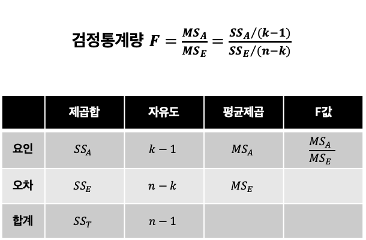
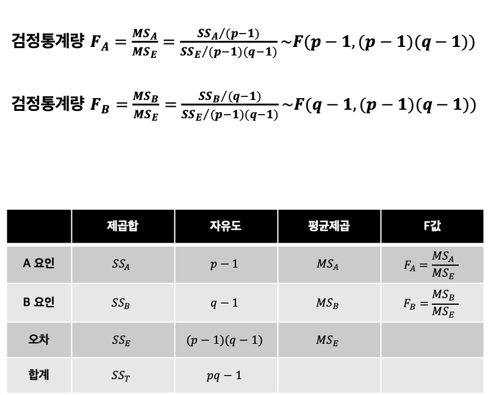

## 4. 분산분석
---

### ANOVA 분석
- 그룹간 평균 차이에 대한 검정
- 그룹간 평균 차이를 검정하지만 분산을 활용하기 때문에 분산분석이라고 부른다.
- 귀무가설: 모든 그룹의 평균이 동일하다. 대립가설: 모든 그룹의 평균이 동일한 것은 아니다.

### ANOVA 분석과 독립표본 t 검정
- ANOVA 분석과 독립표본 t 검정 모두 그룹에 따른 평균 차이를 비교한다.
- 독립표본 t 검정은 두 그룹에 대해서만 평균 차이를 비교할 수 있다.
  - 두 그룹의 평균 차이 비교는 독립표본 t 검정과 One-way ANOVA 분석이 동일하다
- ANOVA 분석은 독립표본 t 검정모다 일반적인 상황에서 활용가능하다.
  - 하나의 범주형 변수에서 다수의 그룹간 평균 차이 비교(One-way ANOVA 분석)
  - 두 개의 범주형 변수에서 다수의 그룹간 평균 차이 비교(Two-way ANOVA 분석)

### 일원배치분산분석(One-way ANOVA)
- 모집단은 정규분포를 따른다
- 요인제곱합의 분포와 오차제곱합의 분포는 서로 독립인 자유도 k-1, n-k의 카이제곱분포를 따른다
- 두 카이제곱분포의 비율은 F 분포를 따른다.

    

    

### 다중비교(Multiple Comparisons)
- 분산분석 결과 귀무가설이 기각되지 않는 경우 수행
- Duncan 방법 > Tukey 방법 > Scheffe 방법으로 모든 그룹을 비교
- Scheffe 방법이 가장 민감한 방법으로 Scheffe 방법에서 확실한 차이가 나는 두 그불은 Duncan 방법으로도 차이가 검증된다.

### 이원배치분산분석(Two-way ANOVA)
- 모집단은 정규분포를 따른다
- 요인을 2개로 확장한 분산분석

    

----

## Quiz
1. 독립표본 t-검정과 ANOVA의 차이점을 모두 고르시오.
   1. X변수의 수 (O, ANOVA는 2개 이상의 변수 가능)
   2. 독립성 가정
   3. X변수내 그룹의 수 (O, ANOVA는 2개를 초과한 그룹 가능)
   4. 정규성 가정
2. 어느 온라인몰에서 서로 다른 3가지 타입의 광고를 기획하여, 각 광고타입벼로 100명씩 뽑아 구매금액이 평균적으로 차이나는지 검증하고자 할 때, 요인의 자유도, 오차의 자유도, 합계의 자유도로 옳은 것은?
   1. 2, 298, 300
   2. 2, 297, 299 (O)
   3. 3, 296, 299
   4. 3, 297, 300
3. 분산분석에서 총변동은 그룹내변동과 그룹간변동으로 정화하게 구분된다. (O)
4. 분산분석의 설명으로 옳지 않은 것을 모두 고르시오.
   1. 등분산인 두 표본에 대한 독립표본 t검정의 양측검정의 p-value는 분산분석의 p-value와 같다. (O)
   2. 분산분석의 대립가설은 모든 그룹의 평균이 다르다는 것이다. (X, 대립가설은 모든 그룹의 평균이 같은 것은 아니다.)
   3. 분산분석은 분석의 목표가 그룹간 평균 비교이지만, 분산을 활용하여 검정한다. (O)
   4. 분산분석 이후 각 그룹별 평균이 같은지를 알아보는 Duncan 방법, Tukey 방법, Scheffe 방법은 보통 그 결과가 동일하다. (X, Duncan > Tukey > Scheffe 순으로 민감하다.)