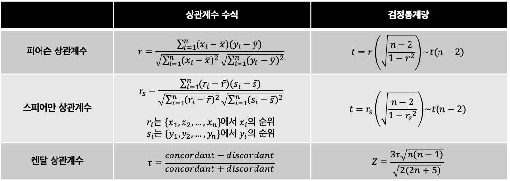

## 5. 상관분석
---

### 싱관계수
- 두 연속형 변수의 선형관계를 확인하기 위해 사용
- 검정통계량 자체보다 상관계수와 산점도가 중요
- 상관계수의 종류: 피어슨 상관계수, 스피어만 상관계후, 켄달 상관계수
- 산점도를 통해 상관계수 파악

### 상관계수의 종류
**1. 피어슨 상관계수(Pearson Correlation Coefficient)**
- 두 연속형 변수의 <u>선형관계(한 직선에 얼마나 모여있는지)정도</u>와 <u>방향</u>
- -1과 1 사이에 값을 가진다.
  - 절댓값 1이 가까우면 선형관계가 정도가 크다

**2. 스피어만 상관계수(Spearman's Correlation Coefficient)**
- 피어슨 상관계수와 달리 데이터 순위를 구한 후 그 순위에 대해 상관계수를 구한다.
- -1과 1 사이에 값을 가진다

**3. 켄잘 상관계수(Kendall Rank Correlation Coefficient)**
- 켄달 상관계수는 두 변수의 순위 일치 정도를 측정한다
- Concordant와 Disconcordant를 사용해서 상관계수 계산
  - Concordant: 순위 증감이 일치하는 데이터 쌍의 수
  - Discordant: 순위 증감이 일치하지 않는 데이터 쌍의 수

|지원자|A 점수|B 점수|A 면접관 점수 순위(낮은순)|B 면접관 점수 순위(낮은순)|Concordant|Discordant|
|--|--|--|--|--|--|--|
|2|69|74|1|1|4|0|
|4|75|80|2|2|3|0|
|5|84|89|3|4|1|1|
|1|87|81|4|3|1|0|
|3|98|95|5|5|-|-|
||||합계||9|1|

    

### 상관계수의 오용
- 상관관계는 인과관계가 아니다.
- 상관계수가 작은 것이 관계가 없는 것은 아니다

    

- 상관계수의 절댓값이 커도 선형관계가 뚜렷하지 않을 수 있다. (이상치가 만든 상관게수)

    

- 상관계수로 기울기를 알 수 없다.
  - 상관계수는 직선에 모여있는 정도를 의미하므로, 직선의 기울기와는 무관하다.

---

## Quiz
1. 상관분석으로 확인할 수 있는 것을 고르시오
   1. 두 변수의 인과관계
   2. 두 변수가 한 직선에 얼마나 모여있는지 (O)
   3. 두 변수의 곡선 관계
   4. 한 변수가 다른 한 변수에 대한 기울기
2. 피어슨 상관계수는 두 변수의 형태가 ordinal(순서형)인 경우, 즉 서열변수 간의 상관관계로, 두 연속형 변수의 분포가 정규분포를 심하게 벗어날 경우의 상관관계를 측정시에도 사용된다. (X, 피어슨 상관계수는 순서형에서 사용하지 않는다)
3. 상관계수에 대한 설명으로 옳지 않은 것은 무엇인가
   1. 상관계수가 크다고 해서 곧 인과관계로 해석할 수 없다 (O)
   2. 상관계수가 작더라도 두 변수간 관계가 있을 수 있다 (O)
   3. 상관계수의 절댓값이 크면 선형관계가 뚜렷하다고 해석한다 (X, 이상치로 인해 뚜렷하지 않을 수 있다.)
   4. 상관계수가 크다는 것은 기울기가 크다는 것과 다르다 (O)
