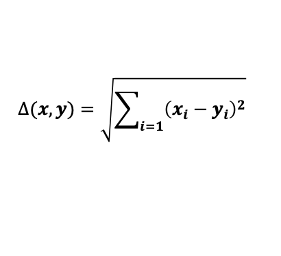

## 6. 시계열분석
---

### 시계열 모형
- 모형 = 시스템(system) + 에러(error)
- '시간'과 '이전 관측자료' 외에 시계열 자료에 영향을 주는 인자는 없다고 가정
- 시스템은 추세 모형과 주기 모형으로 나타낸다

    

### 평활법(smoothing)
- 자료를 매끄럽게 만들어주는 방법
- 탐색적 자료 분석 과정

|평활법 구분|평활법 수식|설명|
|--------|--------|---|
|이동평균평활법(Moving Average Smoothing)||이전 m개의 관측치 평균 이용|
|지수이동평균평활법(Exponentiallyt Weighted Moving Average Smoothing)||이전 관측치에 가중치를 부여|
|단순지수평활법(Simple Exponential Smoothing)||EWMA와 결과가 동일|
|이중지수평활법(Double Exponential Smoothing)||추세가 있는 사계열 사료에 사용하는 평활법|
|삼중지수평활법(Triple Exponential Smoothing)||추세+계절성이 있는 사계열 사료에 사용하는 평활법|

### 분해법(decomposition)
- 시계열 자료 분해(Z) = 체계적 변동 + 비체계적 변동
  - 체계적 변동 = 추세 변동(Trend Variation, T) + 주기 변동(Periodicity Variation)
  - 주기 변동 = 계절 변동(Seasonal Variation, S) + 순환 변동(Cyclic Variation, C)
  - 비체계적 변동 = 잔차(Residual, R)
- 추세의 특징에 따라서 가법모형(Additive)와 승법모형(Multiplicative)으로 구분한다
  - 가법모형은 진폭이 일정한 데이터에 사용 (Z = T + C + S + R)
  - 승법모형은 진폭이 일정하지 않은 데이터에 사용 (Z = T · C · S · R)

### 자기상관함수(ACF)와 부분자기상관함수(PACF)
- 시계열 자료에서 과거와 현재의 상관성을 보는 함수로 자기상관함수(Autocorrelation, ACF)와 부분자기상관함수(Partial Autocorrelation, PACF)가 있다
- ACF, PACF 모두 시차(time lag) k를 X축으로 하여서 계산한다.
  - 현재 시간을 기준으로 k 시간 이전의 관측값과의 상관성을 계산
- PACF는 ACF와 다르게 현재 시점에 영향을 주는 k 시간 이전의 관측값의 상관성만을 계산한다
  - 현재 시점에 영향을 주는 k 시간 이전의 관측값도 사실은 더 이전 시간의 관측값의 영향을 받은 것
  - ACF는 k 시간보다 더 이전의 관측값의 영향력도 초함하지만 PACF는 k 시간보다 더 이전의 관측값의 영향력(종속성)은 배제한다.
- 실제로 관측 자료는 모집단의 표본이기 때문에 SACF(Sample ACF), SPACF(Sample PACF)라고 부르기도한다
- 시계열의 확률 모형을 ACF, PACF로 파악할 수 있다.

### 확률적 시계열 모형
- 시계열 자료가 우연이 아니라 확률적 과정(확률 구조)에 의해서 생성되는 상황
- 확률적 시계열 모형에서 시간에 따른 확률 구조가 변하지 않는 '정상성'을 가진다
  - 엄밀한 의미의 정상성을 검증하기 어렵기 때문에 시간에 따라서 평균과 분산이 불변하는 '약한 정상성'으로 검증

|확률 모형|모형 식|ACF와 PACF|설명|
|-------|-----|----------|---|
|백색잡음과정(white noise process)|||이전 시점과 관련없이 랜덤하게 생성. 정상시계열|
|확률보행과정(random walk process)|||이전 시점 값 + 랜덤한 에러. 시간에 따른 분산과 공분산이 커지는 비정상시계열|
|이동평균과정(moving average process)|||평균, 분산, 공분산이 시간에 무관한 정상시계열|
|자기회귀과정(auto regressive process)|||이전 시점의 가중치에 따라 정상/비정상시계열 결정|

### 자기회귀과정(AR)과 이동평균과정(MA)
1. **자기회귀과정(Auto Regressive)**
   - 현 시점의 관측값이 앞선 시점들의 관측값으로 설명된다.
   - 정상성 조건을 만족하기 위한 가중치 제한
   - AR(p)인 경우 ACF는 소멸 / PACF는 p 시점 이후 절단

2. **이동평균과정(Moving Average)**
   - 현 시점의 관측값이 앞선 시점들의 오차로 설명된다.
   - 가역성 조건을 만족하기 위한 가중치 제한
   - MA(q)인 경우 ACF는 q 시점 이후 절단 / PACF는 소멸

### 자기회귀이동평균과정(ARMA)
- 자기회귀과정 + 이동평균과정
  - 자기회귀과정과 이동평균과정은 쌍대성 조건을 만족
  - 차수가 높은 자기회귀과정은 차수가 낮은 이동평균과정으로 표현 가능 (vice versa)
- ACF는 q-p+1 시범부터 소멸, PACF는 p-q+1 시점부터 소멸

### 비정상시계열 처리
- 비정상시계열은 확률 구조가 일정하게 유지되지 않은 시계열로 대부분의 관측 데이터가 비정상시계열 자료이다
- 비정상시계열은 추세를 가지고 있는 경우가 일반적이다.
  - 결정적 추세: 추세가 확정적이고 지속되는 경우 → 시계열 그래프로 추세 확인 가능
  - 확률적 추세: 추세가 인적합 자료들의 상관관계로 인해 생기는 경우 → ACF가 점진적으로 감소하는 것으로 확인 가능
- 비정상시계열은 정상시계열로 변화해서 분석한다.
  - 결정적 추세인 경우는 추세선을 찾아서 뺀다
  - 확률적 추세인 경우 차분 변환을 통해 정상시계열로 변환한다.
- 차분 변환은 확률적 추세에 적용한다
  - 결정적 추세인 경우에도 사용할 수 있지만 결정적 추세에서는 추세선을 찾아 빼는 것이 효과적이다
  - 확률적 추세인지를 판단하는 검정을 단위근 검정(Unit Root Test)라고 한다. 귀무가설을 기각할 수 없을 때 확률적 추세를 갖는다고 판단한다.

### 자기회귀누적이동평균과정(ARIMA)
- 비정상시계열의 차분 변환이 ARMA를 따르는 모형을 ARIMA라고 한다
- 한 번의 차분 변화로 ARMA 모형을 따르지 않는다면 차분을 한 번더 수행한다.
  - 일반적으로 2번의 차분으로 충분하다

### 시계열 거리 유사도
- 시계열 데이터의 유사도를 측정하여서 그룹화 하는 경우 거리/유사도 측정이 필요하다.
  - ex) 매출 추이에 따른 대리점 군집화

|유사도/거리 알고리즘|수식|설명|
|---------------|---|---|
|유클리디안 거리(Euclidean Distance)||특정 시점을 기준으로 두 시계열 데이터의 차이를 바탕으로 구한다|
|상관 유사도(Correlation Similarity)||두 시계열 데이터가 얼마나 같이 움직이는지 구한다|
|동적 시간 워핑(Dynamic Time Warping)||유클리디안 거리에서 측정할 수 없는 '모형은 유사하지만 시간이 밀린 경우'를 보정한다|
|SAX(Symbolic Aggregated Approximation)||진폭이 있는 시계열 자료를 일정 간격으로 평균을 구하고 심볼로 표현하여서 계산량을 줄인다|

----

## Quiz
1. 시계열분석에 대한 설명으로 옳지 않은 것은?
   1. 가중이동평균법은 관측값마다 다른 가중치를 적용한다는 점에서 단순이동평균볍과 차이가 있다. (O)
   2. 단순지수평활법은 최근의 자료에 더 높은 가중치를 부여하는 방식이다. (O)
   3. 형태 AR(p) 과정에서는, ACF가 p차까지 줄어들다가 이후 0으로 완전히 절단되는 형태를 갖는다. (X, AR은 PACF가 p 이후 절단)
   4. 추세가 있는 비정상시계열을 차분(differencing)이라는 변환을 통해 시간에 따라 변화의 수준이 비슷한 정상시계열을 만들 수 있다. (O, 특히 확률적 추세에 적합)
2. 시계열 변동의 특징으로 옳지 않은 것은?
   1. 추세변동은 장기간에 걸쳐 나타나는 추세이다. (O)
   2. 순환변동은 장기적ㅇ니 추세석놔 다르게 주기적으로 나타나지 않는 변동이다. (X, 순환변동은 주기적으로 나타나는 변동)
   3. 계절변동은 계절적 요인이 작용하여 1년 주기로 나타나는 변동이다. (O)
   4. 불규칙변동은 시간에 따라 규칙성 없이 예측 불가능하게 우연적으로 발생하는 변동이다. (O)
3. 시계열 자료의 분행 관련 특징으로 옳지 않은 것은?
   1. 진폭이 점점 증가한다면 Additive Model이 적합하고 진폭이 일정하다면 Multiplicative Model이 적절하다. (X, Additive Model은 진폭이 일정한 경우 Multiplicative Model은 진폭이 점차 증가하는 경우)
   2. Additive Model은 변동요인들 간의 서로 독립이라고 가정한다. (O)
   3. Multiplicative Model의 관측값 Z는 시계열 변동 요인들의 곱으로 설명될 수 있다는 가정 하에 만들어진 모형이다. (O)
   4. Additive Model에서 T는 추세변동, C는 순화변동, S는 계절변동, R은 분규칙변동을 의미하며, 원 시계열은 이들의 덧셈으로 구성되는 모형이다. (O)
