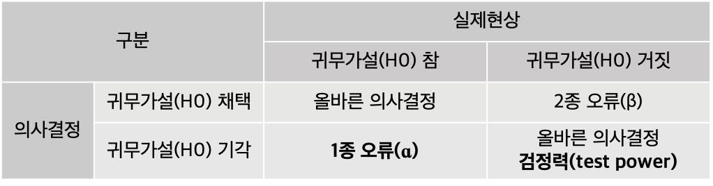

## 3. 추정과 검정
---

### 추정
- 표본 정보(통계량)을 통해 모집단 정보(모수)를 파악하는 과정
  - 모수를 추정하기 위해 사용한 통계량을 추정량이라고 한다
  - ex) 모평균(모수)를 추정하기 위해 표본평균(추정량)을 사용한다.
- 점추정과 구간추정으로 구분한다
  - 점추정: 모수를 한 개의 값으로 추정
  - 구간추정: 모수가 포함될 것이라 기대하는 구간을 추정

### 점추정
- 확률밀도함수 f인 확률변수 X에서 x1, x2, ..., xn이 관측된 경우, f(x1, x2, ..., xn | θ)를 최대화시키는 θ를 찾아서 모수를 추정한다.

### 점추정의 성질
**1. 불편성(unbiasedness)**
- 편의(bias) = 점추정치의 평균 - 실제 모수
- 점추정을 할 때 편의가 작아야한다.
- 불편추정량은 점추정치와 실제 모수가 동일한 경우로 점추정의 목적은 불편추정량을 찾는 것이다.

**2. 효율성(efficiency)**
- 추정치의 확률밀도함수를 구했을 때 분산이 작은 것을 선택한다.
  - 분산이 작다 = 한 곳으로 몰려있다
- 분산이 최소가 된느 불편추정치를 최소분산불편추정치(Minimum Variance Unbiased Estimate, MVUE)라고 한다

**3. 일치성(consistency)**
- 추정치와 모수의 일치 정도를 나타낸다.
- 표본의 크기가 클수록 불편추정량은 일치추정량이 된다.
  - 대수의 법치: 표본크기가 클수록 표본 평균이 모평균이 된다.

**4. 충분성(sufficiency)**
- 한 추정량이 모수에 대한 정보를 모두 가지고 있다면 다른 추정량은 필요가 없다
- 충분통계량은 불편추정량 중 최소분산을 갖는 추정량을 찾는 데 사용한다.

### 최대가능도추정(Maximum Likelikood Estimation, MLE)
- 모수를 추정할 때 가능도가 최대가 되는 것을 선호한다.
- 관측치가 나올 수 있는 확률이 최대가 되는 확률밀도함수의 파라미터를 구하는 과정
- 관측치가 iid(Independent and Identically Distributed)이면 개별 관측치에 대한 곱으로 표현할 수 있다. → 로그 변환을 통해 합으로 표현

    

### 구간추정
- 구간추정은 모수가 있을 것이라고 판단되는 구간을 추정
- 구간을 추정하는 방법의 이론적 배경은 중심극한정리
  - 중심극한정리에 따르면 모집단의 분포와 상관없이 표본의 크기가 충분히 큰 표본평균은 평균이 μ이고 분산이 σ^2/n인 정규분포를 따른다.
  - 정규분포를 평균이 0이고 분산이 1인 표준정규분포로 표준화한다.
  - 표준정규분포에서 -1.96과 1.96 영역 안에 95%의 데이터가 있다.
  - 표준정규분포에서 -1.96과 1.96 영역을 95% 신뢰구간이라고 한다.
- 95% 신뢰구간의 의미는 표본평균을 100번 구해서 신뢰 구간을 구했을 때 95번은 모평균을 포함한다는 것을 의미한다.

### 구간추정 시 유의사항
- 모평균을 추정하는 것이므로 모평균에 대한 정보는 없다
- 모분산에 대한 정보가 있을 경우 모분산을 활용하여서 신뢰 구간을 계산한다
- 모분산에 대한 정보가 없을 경우 표본분산을 활용할 수 있다
- 표본의 크기가 작다면 표준정규분포 대신 t 분포를 활용한다.

    

### 가설검정
- 표본의 정보를 바탕으로 가설을 세우고, 모집단에 대해 가설이 합당한지 판단한다
- 가설검정의 과정: 가설(귀무가설, 대립가설) 수립 → 가설통계량 산출 → p-value 산출 → p-value가 유의수준 ɑ보다 작으면 귀무가설 기각
- 대립가설의 성격에 따라서 단측검정과 양측검정으로 구분

### 가설의 종류
- 귀무가설(Null Hypothesis, H0): '차이가 없다', '관계가 없다'의 가설. 기각하고 싶은 가설
- 대립가설(Alternative Hypothesis, H1): '차이가 있다', '관계가 있다'의 가설. 증명하고 싶은 가설
- 기본적으로는 귀무가설이 맞다는 가정하에 대립가설의 증거가 충분할 때 귀무가설을 기각한다.

### 검정통계량과 p-value
- 가설검정에서 사용하는 통계량을 검정통계량으로 표본의 특징을 담고 있다.
- 검정통계량은 귀무가설이 참아라는 가정하에 계산되며 확률분포를 따르도록 설계한다.
- p-value는 산출된 검정통계량이 귀무가설은 참이지만 단지 특이한 케이스일 확률
- p-value가 작아야 귀무가설을 기각할 수 있다. = 산출된 검정통계량이 특이한 케이스가 아니다. = 귀무가설이 잘못되었다.

### 오류와 유의수준
- p-value는 유의수준보다 작아야 기각할 수 있다.
- 유의수준은 허용할 수 있는 1종 오류의 확률로 일반적으로 5%(0.05)로 설정한다

    

### 주요 검정통계량
|구분|검정통계량의 분포|
|---|-------------|
|한 개의 모평균의 검정 및 추정(t-검정)|샘플사이트가 작고 모표준편차를 모르는 경우, t분포|
|한 개의 모평균의 검정 및 추정(Z-검정)|샘플사이즈가 크거나 모표준편차를 아는 경우, Z 분포|
|분산분석|F 분포|
|회귀분석|개별 독립변수에 대한 검정시, t 분포 
|회귀분석|회귀모형의 유의성 검정시, F 분포|
|카이제곱검정|카이제곱 분포|

### 가설검정의 종류

**1. t 검정**
1. 단일표본 t-검정(One Sample t-test)
    - 모평균에 대한 검정
    - 모집단의 정규분포를 가정
    - 관측된 표본의 평균이 기존에 알려진 모평균과 같은/큰/작은지 검정

    

2. 짝지어진 t-검정(Paired t-test)
    - 표본은 두 개이지만 두 개의 표본은 대응표본으로 짝지어진다.
      - ex) 시간에 따라서 두 대리점의 매출 차이 검정.
    - 대응표본이 있다는 것이 독립표본 t 검정과의 가장 큰 차이
    - 짝을 지어 하나의 표본으로 만든 이후 단일표본 t 검정과 동일한 방법으로 검정
    - 관측된 대응표본 차이의 평균이 기존에 알려진 모평균과 같은/큰/작은지 검정

    

3. 독립표본 t-검정(Independent two sample t-test)
    - 서로 독립인 두 개의 그룹 간의 차이를 검정
    - 평균에 대한 검증임에도 불구하고 분산을 고려해야한다.
      - 동일한 평균 차이도 표본의 변동성에 따라서 차이 정도에 대한 다른 해석이 가능하다.
    - 두 표본간의 평균차이가 클수록, 그룹 내의 분산이 작을수록 검정통계량은 커진다.
    - 관측된 두 독립 표본의 평균이 차이가 나는지 검정
    - 독립표본 t 검정은 독립성, 정규성, 등분산성을 가정한다
      1. 독립성: 관측치는 각각 독립
      2. 정규성: 두 그룹의 모집단은 정규분포
      3. 등분산성: 두 그룹의 분산은 동일. 다른 분산일 경우 이분산 독립표본 t 검정 사용 

    

**2. 카이제곱 검정**
- 카이제곱 검정은 독립성 검정, 적합도 검정, 동질성 검정으로 사용한다.
- 독립성 검정은 두 범주형 변수의 독립성을 검정한다
- 두 범주형 변수에 대한 교차표를 생성하여서 기댓값 E와 관측값 O로 검정통계량을 계산한다.

    

------
## Quiz

1. 모수와 통계량에 대한 설명으로 옳지 않은 것은?
   1. 통계량의 값은 샘플을 어떻게 뽑더라도 변하지 않는 값이다. (X, 통계량은 표본의 값이므로 변한다)
   2. 모수는 모집단에서 계산되는 통계량으로 알려지지 않는 경우가 많다. (O)
   3. 모집단에서 추출된 표본으로 통계량을 산출하고 통계량을 기반으로 모수를 추론하는 과정으로 이뤄진다. (O)
   4. 표본은 추출하는 방식에 따라 서로 다른 표본이 선택될 수 있다. (O)
2. 모평균에 대한 신뢰구간에 대해 옳지 않은 것은?
   1. 동일 조건이면, 샘플 사이즈가 커질수록 구간의 폭은 커진다. (X, 구간의 폭이 작아진다)
   2. 95% 신뢰구간보다 99%신뢰구간의 폭이 더 크다 (O)
   3. 같은 신뢰구간이면 신뢰구간의 폭은 작을수록 좋다. (O)
   4. 모집단의 표준편차 σ를 모를 경우, 신뢰구간 구할 때 t-value가 필요하다. (O, 소표본인 경우 t 분포를 활용)
3. p-value는 검정통계량보다 더 평범한 값이 나올 확률을 의미한다. (X, p-values는 검정통계량보다 더 특이한 값이 나올 확률을 의미한다.)
4. 각 시점마다 두 값의 차이가 있는지 검정하는 검정방법은 무엇인가>
   1. 짝지어진 t-검정 (O)
   2. ANOVA
   3. 독립표본 t-검정
   4. 단일표본 t-검정