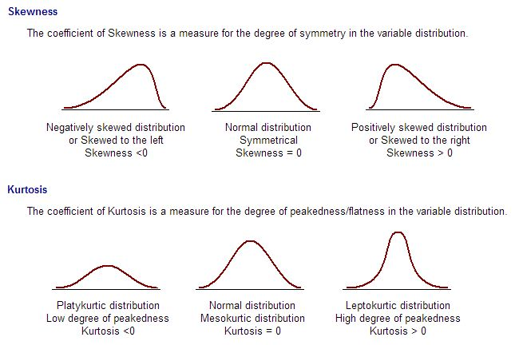

## 2. 탐색적 데이터 분석
---

### 수치형 데이터의 탐색적 데이터 분석
- 수치형 데이터를 EDA로 분포를 분석. 위치통계량, 변위통계량, 모양통계량을 파악

**1. 위치 통계량**
1. 중심위치를 파악하기 위한 평균, 중앙값, 최빈수, 절사평균
- 평균은 산술평균, 기하평균, 조화평균, 절사평균이 있다.
  - 산술평균이 가장 일반적이지만 이상값에 영향이 크므로 절사평균도 활용
  - 기하평균은 측정값이 모두 양이고, 성장률과 변화율에 대한 평균으로 활용
  - 조화평균은 일정금액으로 구입할 수 있는 물건의 수량의 평균, 평균속도를 구할 떄 활용
- 중앙값을 기준으로 좌우의 데이터의 개수는 동일하다.
2. 사분위수와 백분위수, 다섯 수치 요약
- 분위수는 데이터를 크기 순서대로 나누고 n 등분하였을 때의 경계값으로 4분위수, 100분위수가 있다
- 다섯 수치 요약 = 최소, Q1, 중앙, Q3, 최대

**2. 변위 통계량**
1. 범위와 사분위범위
- 범위는 이상값에 영향을 많이 받기 때문에 사분위범위(Q3-Q1, IQR)를 활용
2. 분산과 표준편차
- 관측치에서 평균을 빼고 제곱한 평균. 제곱을 하지 않고 평균을 구하면 0이 된다.
- 표준편차는 분산의 제곱근
3. 변동계수(Coefficient of Variation, CV)
- 표본표준편차를 표본평균으로 나눈 값
- CV가 크면 흩어짐 정도가 큰 것이다.

```
확률변수 X의 값이 100배가 된다면
→ X의 평균은 100배
→ X의 분산은 10,000배
→ X의 표준편차은 100배
→ X의 CV은 그대로
```

**3. 모양 통계량**
1. 왜도와 첨도
- 왜도는 비대칭성을 나타내고, 첨도는 뾰족한 정도를 나타낸다
- 정규분포(왜도=0, 첨도=0)을 기준으로 계산한다.

<p align="center">
    
</p>

<p align="center">
    
</p>

### 그림 기반의 탐색적 데이터 분석
- 차트를 활용하여서 수치옇 데이터와 범주형 데이터에 대한 EDA

|상황|차트|설명|
|---|---|---|
|하나의 수치형 데이터|히스토그램, 박스플롯|중심 및 이상치 파악|
|하나의 범주형 데이터|파이차트, 컬럼차트, 바차트|빈도 파악|
|두 수치형 데이터|산점도|크기가 큰 경우 샘플링하여서 산점도 그린다|
|두 범주형 데이터|교차표, 히트맵, 스택트컬럼차트, 영역차트||
|범주형 변수와 수치형 데이터|그룹별 박스플롯||
|다변량 데이터||위의 경우를 조합하여서 패턴 탐지|


---

## Quiz
1. 평균에 대한 설명으로 옳지 않은 것은?
   1. 평균은 중앙값, 최빈값 같은 통계량에 비해 이상치에 더 민감하다 (O)
   2. 물가상승률이나 평균속도를 조화평균으로 구한댜. (X, 물가상승률은 기하평균)
   3. 물가지수 산정시 가중평균을 활용한다. (O)
   4. 인구증가율은 기하평균, 일정금액으로 구입할 수 있는 물건의 수량은 조화평균으로 구한다. (O)
2. 통계량의 설명에 대해 옳지 않은 것은?
   1. 편차의 제곱합을 활용하여 분산과 표준편차를 산출할 수 있다. (O)
   2. 변수 X의 평균이 1일 때, 100X의 평균은 100이다. (O)
   3. 변수 X의 표준편차가 1일 때, 100X의 표준편차는 100이다. (O)
   4. 변수 X의 변동계수가 1일 때, 100X의 변동계수는 100이다. (X, 변동계수는 단위에 따라 달라지지 않는다.)
3. 연속형 변수 X의 단변량 분포를 확인하기 위한 차트가 아닌 것은?
   1. Box Plot
   2. 히스토그램
   3. 산점도 (X, 두 개의 연속형 변수에 사용)
   4. Q-Q Plot