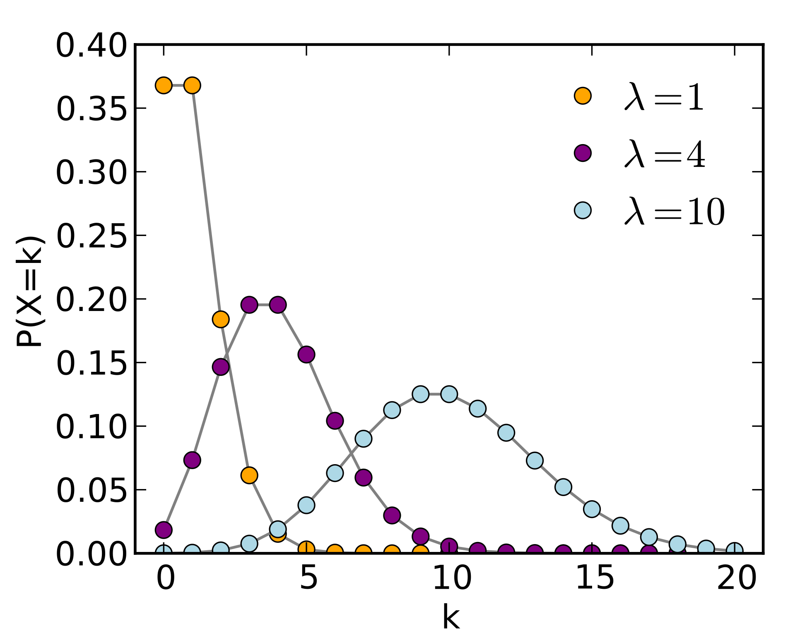
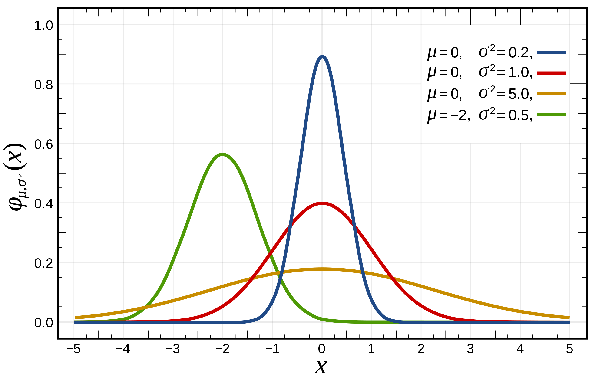
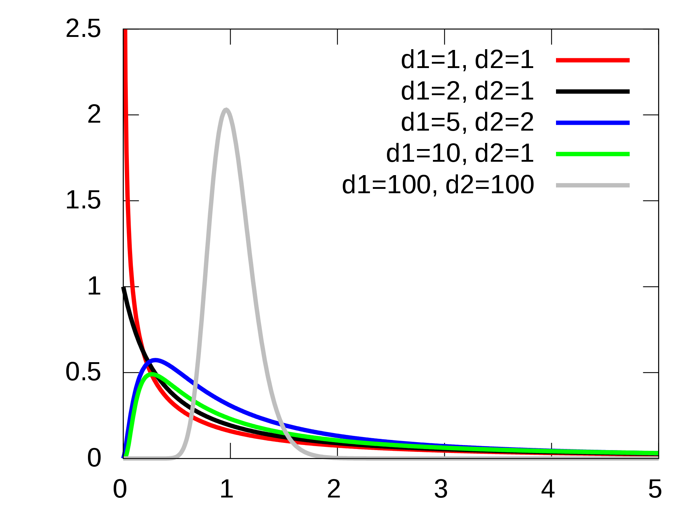
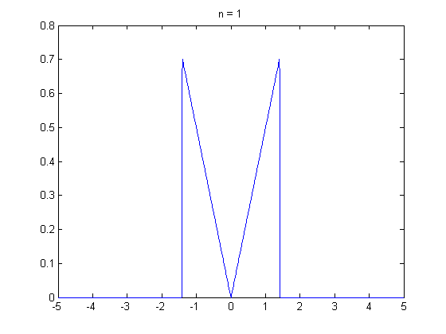
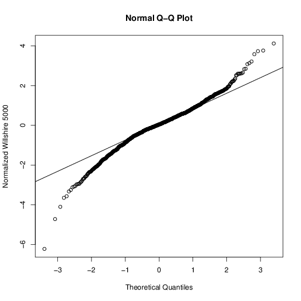

## 1. 확률 변수와 확률 분포
---

### 확률 변수(Random Variable)의 정의
- 펴본공간에서 정의된 실수값 함수
- 표본공간에서 일정한 확률을 가지고 발생하는 사건에 수치를 일대일 대응시킨 함수
- 주사위를 굴릴 때 1인 나오는 사건 → X=1인 사건

### 확률 변수의 종류
1. 이산형 확률 변수(Discrete Random Variable)
   - 확률 변수가 취할 수 있는 값이 정수와 같이 이산적인 형태
   - ex) 동전 던지기, 주사위의 눈 
2. 연속형 확률 변수(Continuous Random Variable)
   - 확률 변수가 취할 수 있는 값이 주어진 구간에서 무한개
   - ex) 다음 사건이 일어날 때까지의 대기시간  

### 확률질량함수와 확률밀도함수
1. 확률질량함수(Probability Mass Function, pmf)
   - 이산형 확률 변수 X의 분포 함수
   - 확률질량함수 p(x)는 X가 취할 수 있는 값 x1, x2, ...와 P[X=x1], P[X=x2], ... 를 대응시킨 함수이다.

    

2. 확률밀도함수(Probability Density Function, pdf)
   - 연속형 확률 변수 X의 분포 함수
   - 확률질량함수와 다르게 특정 값에서의 함수 값은 모두 0이다. 확률밀도함수는 구간에서 정의한다.

    

### 확률 분포의 종류
1. 균등 분포(Uniform Dsitribution)
   - 확률 분포 함수가 정해진 곳에서 그 값이 일정한 분포
   - 이산확률분포와 연속확률분포에서 정의

    

2. 베르누이 분포(Bernoulli Distribution)
   - 베르누이 시행의 분포
   - 성공/실패의 두 가지 상호 배반적 결과 중 하나가 나오는 실험에서의 분포

    

3. 이항 분포(Binomial Distribution)
   - 베르누이 시행을 n번 독립 시행하였을 때 x번 성공할 확률(이산확률분포)

    

4. 포아송 분포(Poisson Distribution)
   - 일정한 단위시간이나 단위공간에서 일어나는 사건의 수에 대한 이산확률분포
   - 단위 시간 동안 일어나는 평균 사건의 수를 λ라고 한다.
   - λ가 커질수록 분포의 중심이 오른쪽으로 이동하면서 좌우대칭인 분포에 근사한다.
   - 이항 분포에서 n이 크고 p가 작다면 λ=np인 포아송 분포에 근사한다.

    

    

5. 정규 분포(Normal Distribution)
    - 평균과 분산을 통해 모양이 결정되는 대표적인 연속 확률 분포
    - 평균 = 중앙값 = 최빈깂 → 좌우 대칭의 종모양
    - 특히 평균이 0이고 분산이 1인 정규 분포를 표준 정규 분포(Z 분포)라고 한다.

    

    

6. T 분포(T Distribution)
    - 소표본에서의 표본평균의 분포가 정규 분포와 다른 형태인 t 표본을 따른다.
    - t 분포는 자유도에 따라서 모양이 바뀌며, 자유도가 커질수록 표준정규분포에 근사한다
    - t 분포는 정규 분포보다 꼬리가 두꺼운 특징이 있다.

    

    

7. 카이제곱 분포(Chi-squared Distribution)
   - k 개의 서로 독립인 표준 정규 분포 Z의 제곱합은 자유도 k의 카이제곱분포를 따른다.
   - 제곱을 합한 것이므로 양수 값만 가진다.
   - 자유도 k가 클수록 정규분포 모양에 근사하다.

    

    

8. F 분포(F Distribution)
    - 서로 독립인 두 카이제곱 분포 V1, V2를 각각의 자유도 k1, k2로 나누면 F 분포를 따른다.
    - 비율이므로 양수 값만 가진다.

    

    

### 중심극한정리(Central Limit Theorem, CLT)
- 모집단이 어떠한 분포를 따를지라도, 모집단에서 표본 크기 n이 충분히 커진다면, 표본평균은 정규분포를 따른다.

    

    

### 분포의 시각화
- 히스토그램 또는 QQ Plot으로 분포 확인
- QQ Plot은 이론퀀타일과 샘플퀀타일을 비교하여서 샘플퀀타일이 특정 분포의 이론퀀타일과 유사한지 확인

------
## Quiz

    

1. 다음은 가로축이 이론적 quantil, 세로축이 샘플 quantile인 Q-Q 플롯이다. 어떤 분포에 대해 그린 Q-Q 플롯인가?
    1. fat tail 분포 (O)
    2. thin tail 분포 
    3. 오른쪽으로 꼬리가 긴 분포 
    4. 왼쪽으로 꼬리가 긴 분포 
2. 정규 분포의 설명으로 옳지 않은 것은?
   1. 정규 분포는 수집된 자료의 분포를 근사하는 데에 자주 사용되며, 이는 중심극한정리에 기반하여 독립적인 확률변수들의 평균이 정규 분포에 가까워지는 성질이 있기 때문이다. (O)
   2. 정규 분포는 평균을 주위로 좌우 대칭이며, 종모양이고, 평균을 주위로 양쪽 1배의 표준편차안에 약 68%, 2배의 표준편차 안에 약 92%, 3배의 표준편차 안에 약 99%의 데이터가 있다. (X, 2배의 표준펀차 안에 95%의 데이터가 있다.)
   3. 학생 성적을 표준화 하였을 때 평균은 0이고 표준편차는 1이며, 학생의 발 사이즈를 표준화 하였을 때에도 편균은 0, 표준편차는 1이다. (O)
   4. 소표본의 경우 표본평균의 분포가 정규 분포와 다른 형태를 띄고 있음을 보고 발견한 분포가 t 분포이다.
3. 분포에 대한 설명으로 옳지 않은 것을 모두 고르시오
   1. 카이제곱 분포를 따르는 변수 X의 값은 음수가 나올 수 없으며, F 분포를 따르는 변수 Y의 값은 음수가 나올 수 있다. (X, F 분포 역시 음수가 나올 수 없다)
   2. F 분포를 따르는 변수 Y는 자유도에 따라서 모양이 달라지며, 자유도가 커질수록 좌우 대칭인 종모양이 된다. (O)
   3. 책 1페이지당 오탈자가 발생하는 건수는 균등분포에 적합시키기 적당하다. (X, 포아송분포)
   4. 성공과 실패에 대한 확률분포는 베르누이 분포로 나타낼 수 있다. (O)
4. 다음 중 확률 분포의 활용 매칭으로 옳지 않은 것은?
   1. 포아송분포 - 단위시간당 발생하는 사건수(O)
   2. 이항분포 - 성공과 실패의 두 가지 선택이 있을 때 성공의 횟수(O)
   3. F 분포 - 선형모형 회귀계수 추론, 분사눈석시, (설명하는 변동)/(설명하지 못하는 변동)이 F 분포를 따름 (X, 선형모형 회귀계수 추론은 t 분포)
   4. t 분포 - 소표본 모집단 평균 검정, 두 독립 표본의 평균차 검정 (O)
5. 중심극한정리는 모집단의 분포와 상관없이 표본 평균은 샘플사이즈가 커질수록 정규 분포를 따른다는 정리이다. (O)