## 4. 머신 러닝 
-----

### [1. 머신러닝 기초](./notes/머신러닝%20기초.md)
- 머신 러닝의 방법은 지도 학습, 비지도 학습, 강화 학습으로 구분한다

### [2. 모형 평가](./notes/모형%20평가.md)
- 회귀 모형 평가를 위한 지표: MAE, (R)MSE, (S)MAPE, R-Square, 설명분산점수
- 분류 모형 평가를 위한 지표: Confusion Matrix, Accuracy, Precision, Recall, F1-Score, Cross Entorpy Loss, AUROC

### [3. 군집화](./notes/군집화.md)
- 군집화의 방법으로는 계층적 군집화, 분할 군집화, 모델 기반 군집화가 있다
- 군집화를 수행하기 위해서는 거리, 유사도 지표가 필요하다
  - 민코우스키 거리, 표준화 유클리드 거리, 코사인 유사도, 마할라노비스 거리, 단순일치계수, 자카드유사도
- 계층적 군집화는 병합적 군집화와 분할적 군집화로 구분하며 병합적 군집화는 '무엇이 유사한 군집'인지 정의해야한다.
  - 단순연결법, 완전연결법, 평균연결법, 중심연결법, 와드연결법
- 분할 군집화는 K-Means 알고리즘이 있으며 군집 내 거리는 가깝고 군집 간 거리가 먼 군집을 만드는 것이 좋다
- 모델 기반 군집화는 GMM이 있으며 K 개의 확률 분포가 혼합 계수를 가중치로 결합되었다고 가정한다. 최대 가능도 추정을 기반으로 한 EM 알고리즘으로 내재된 확률 모형의 모수를 추정한다.

|[실습파일: 계층적 군집화](./계층적%20군집화.json)|[실습파일: 분할 군집화](./분할%20군집화.json)|[실습파일: 가우시안 혼합 모형](./가우시안%20혼합%20모형.json)|
|-|-|-|
||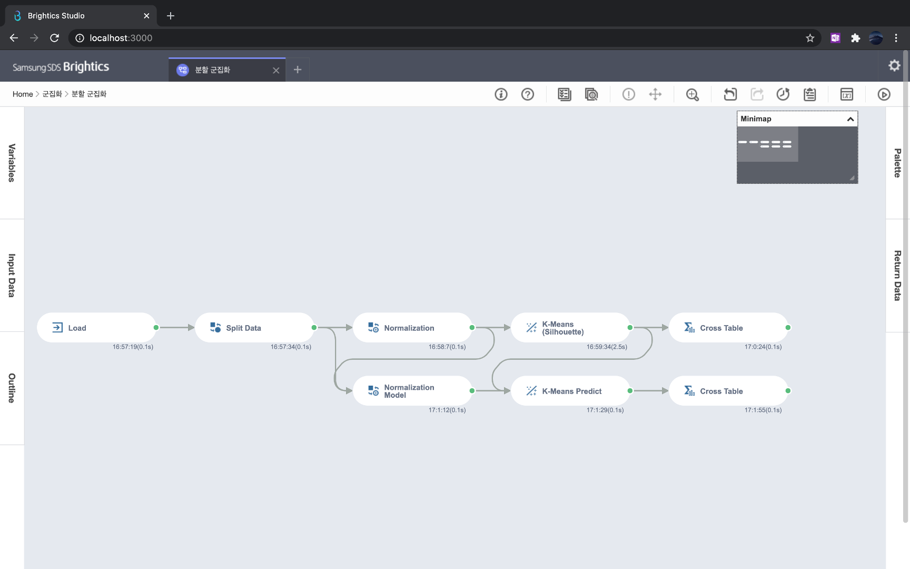|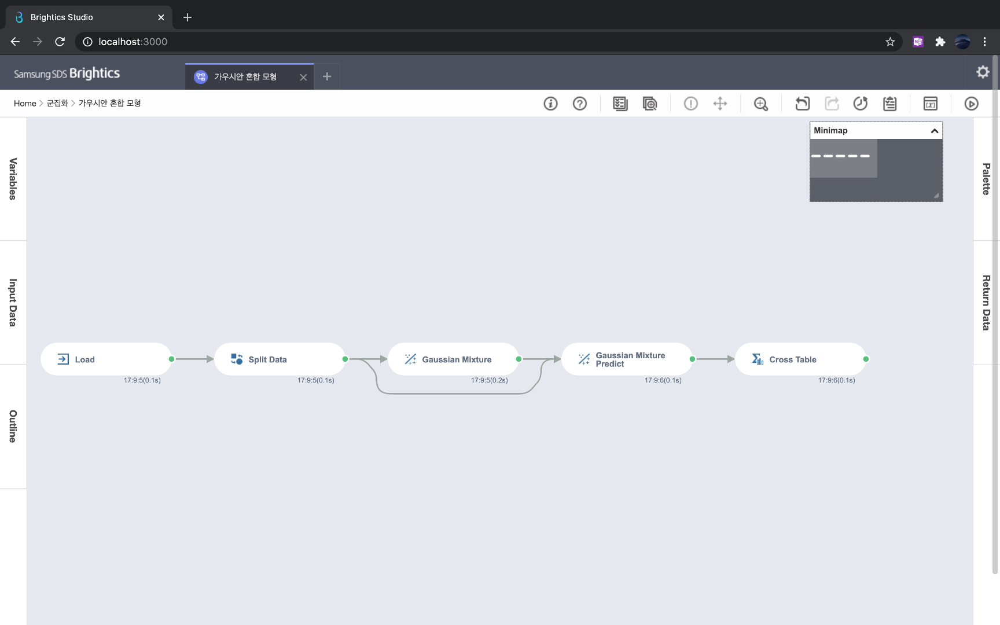|

### [4. 차원축소](./notes/차원축소.md)
- 차원축소를 통해 차원의 저주를 피하고(효율적인 연산) 유의미한 변수를 얻을 수 있다
  - 주의! 기존의 변수를 선택하는 것이 아니라 기존의 변수를 조합하여서 새로운 주성분을 얻는 것이다
- 차원축소를 위해 주성분분석(PCA)가 수행되며 고윳값 분해(일반적으로는 특성값 분해) 알고리즘이 사용된다

|[실습파일: 차원축소](./차원축소.json)|
|-|
|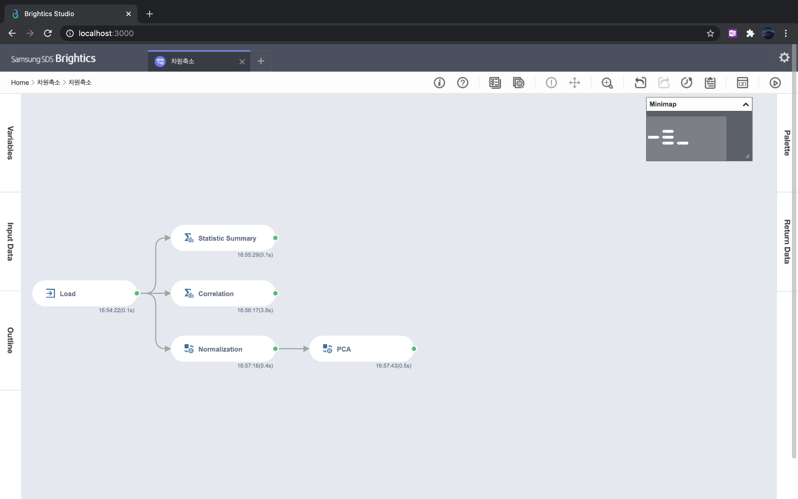|

### [5. 회귀](./notes/회귀.md)
- 회귀: 독립변수로 종속변수를 설명하는 모수를 찾는다
- 하나의 독립변수를 사용하면 단순선형회귀, 다수의 독립변수를 사용하면 다중선형회귀
- 회귀식은 추정값과 관측값의 차이(잔차)의 제곱합을 최소화하는 것으로 학습한다.
- 벌점화회귀는 예측력을 높이기 위해 과적합을 피하기 위한 방법으로 Ridge, Lasso, Elastic-Net 회귀가 있다

|[실습파일: 단순선형회귀](./단순선형회귀.json)|[실습파일: 다중선형회귀와 벌점화회귀](./다중선형회귀와%20벌점화회귀.json)|
|-|-|
|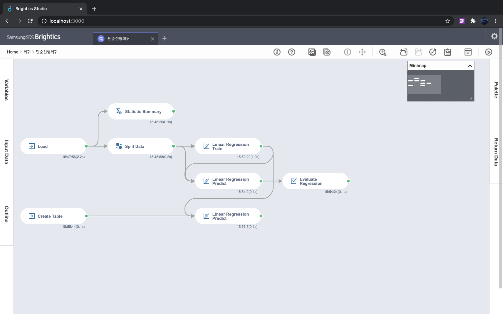|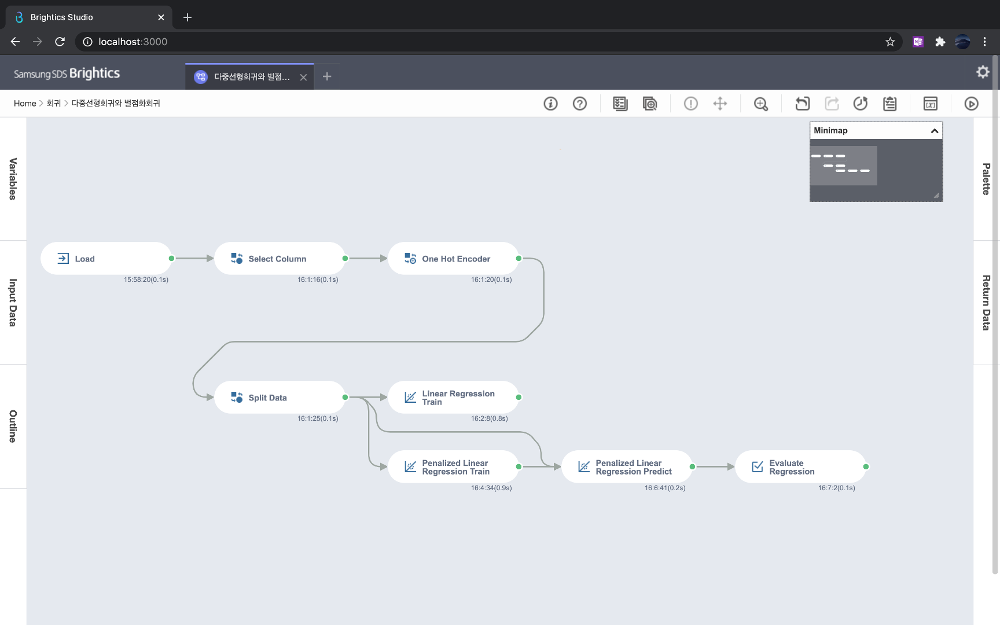|
|

### [6. 분류](./notes/분류.md)
- 로지스틱 회귀, 소프트맥스 회귀, 나이브 베이즈 분류

|[실습파일: 로지스틱 회귀](./로지스틱%20회귀.json)|[실습파일: 나이브 베이즈](./나이브%20베이즈.json)|
|-|-|
|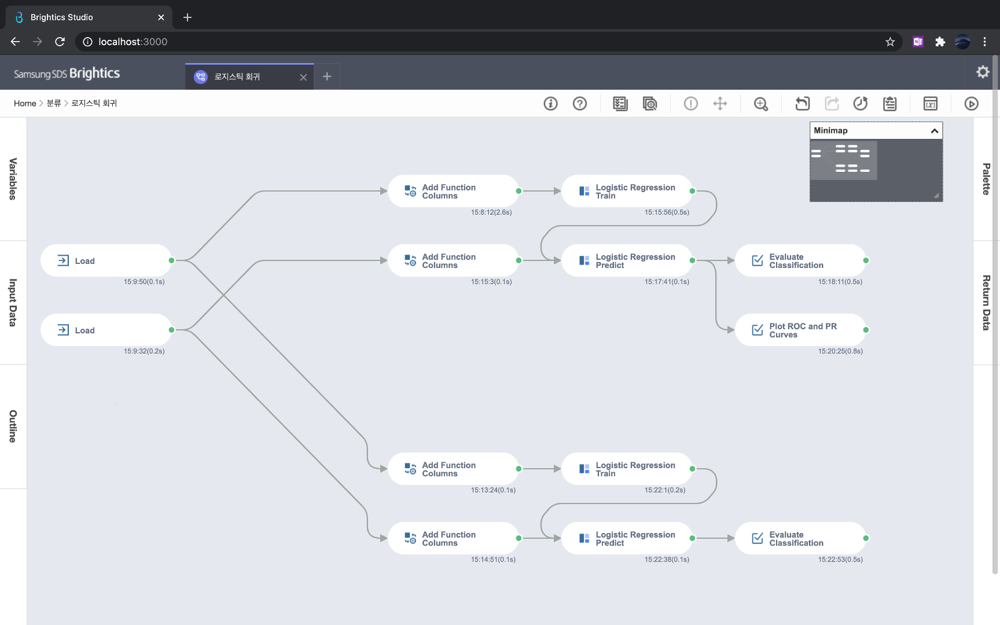|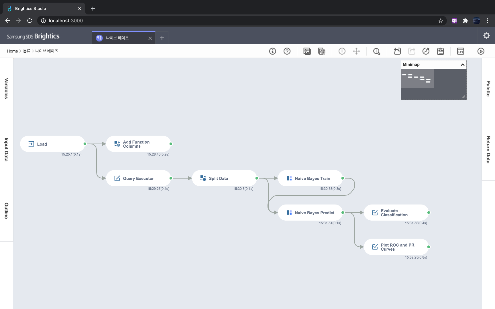|
|

### [7. 회귀 및 분류](./notes/회귀%20및%20분류.md)
- KNN: 가장 가까운 K개의 데이터를 보고 분류
- SVN: Margin Maximization하는 Hyperplane을 찾아서 분류
- Decision Tree: 노드가 분기점에 되어서 특정 변수가 특정 조건을 만족할 때마다 트리의 깊이기 깊어짐
  - 최종적으로 불순도가 낮아지는 방향으로 트리 성장
  - 불순도를 평가하기 위해서 Entropy와 Gini 계수 활용
- 배깅(랜덤 포레스트): 다양한 트리를 구축하고 결합하여서 최종 클래스 결정
- 부스팅: 선행 모델에서 틀린 정도를 후행 모델이 예측하여서 점진적으로 성능 개선
  - 가중치 기반의 부스팅과 오차 기반의 부스팅 존재

|[실습파일: KNN](./KNN.json)|[실습파일: SVM](./SVM.json)|[실습파일: 의사결정나무](./의사결정나무.json)|[실습파일: 랜덤포레스트](./랜덤포레스트.json)|[실습파일: 부스팅](./부스팅.json)|
|-|-|-|-|-|
|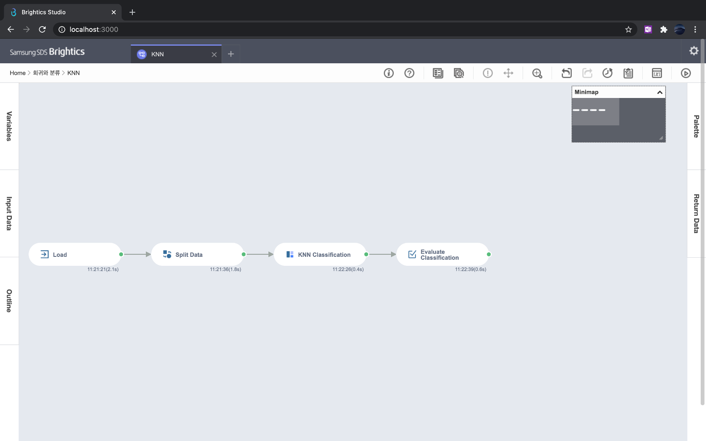|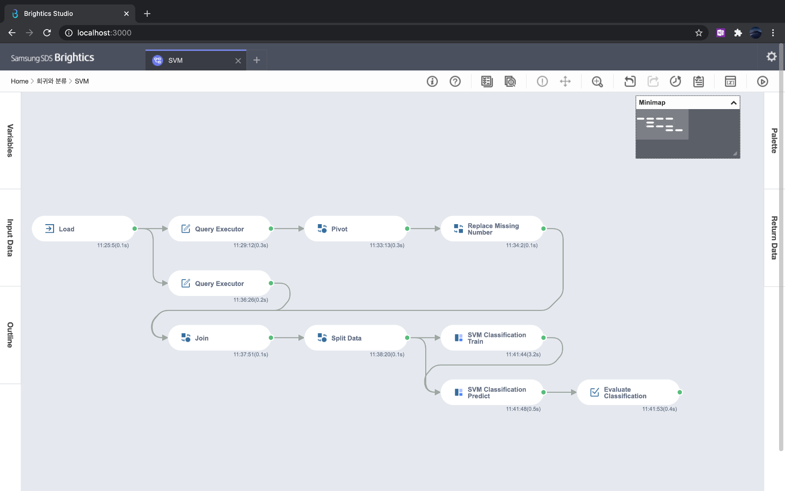|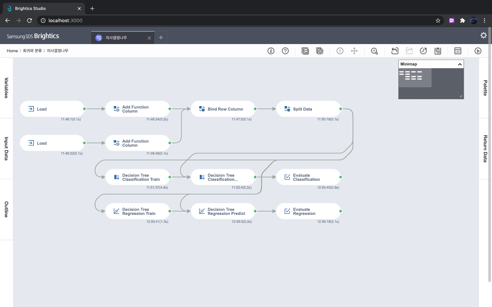||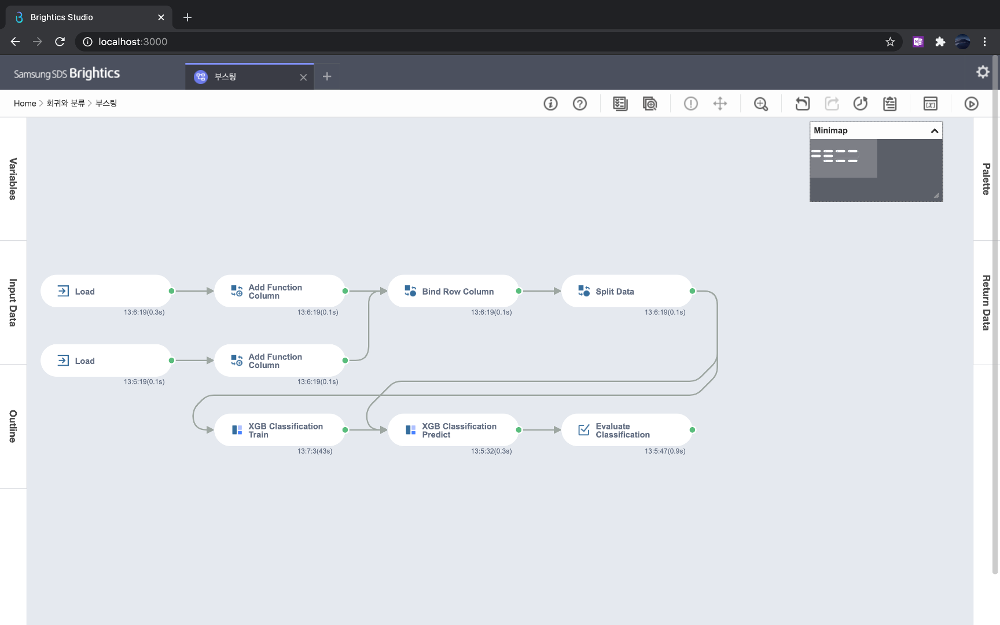|

### [8. 추천](./notes/추천.md)
- 연관성 분석은 연관 규칙을 찾는 분석이다
- 연관 규칙은 함께 구매된 아이템이 무엇인지 지지도(support), 신뢰도(confidence), 향상도(lift)로 판단한다
- 연관 규칙을 탐색하는 효율적인 알고리즘으로 연역적 알고리즘과 빈발탐색성장 알고리즘이 있다

|[실습파일: 연관성 분석](./연관성%20분석.json)|
|-|
|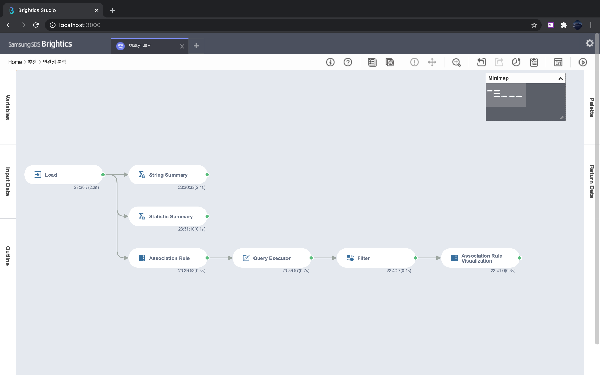|