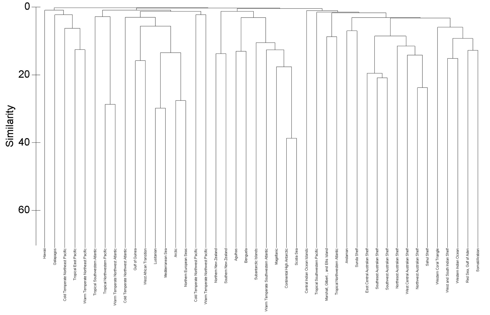
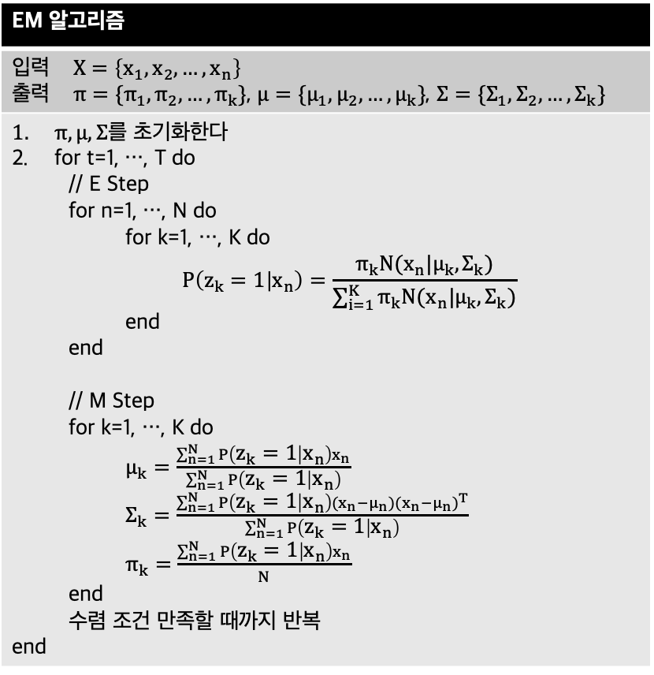

## 4. 군집화(Clustering)

### 군집화의 정의
- 군집화: 데이터의 특징(feature)을 기준으로 유사한 데이터끼리 하나의 그룹(혹은 클래스)로 묶는 방법
- 비지도학습으로 라벨 데이터가 없다

### 거리와 유사도
- 거리와 유사도에 근거하여서 그룹을 판별

|거리 및 유사도 지표|수식|설명|
|--------------|----|---|
|민코우스키 거리(minkowski distance)||맨하탄 거리, 유클리드 거리, 체비셰프 거리의 일반|
|표준화 유클리드 거리||유클리드 거리 + 표준편차 정규화로 데이터 산포와 척도에 따른 왜곡 방지|
|코사인 거리(cosine distance)||두 벡터의 방향을 비교. 문서 비교에 활용|
|마할라노비스 거리(mahalanobis distance)||분산을 고려한 거리. 이상치 탐색에 활용|
|단순일치계수(simple matching coefficient)||이산형 변수 거리에 활용|
|자카드 유사도(jaccard similarity)||이산형 변수 유사도에 활용|

### 군집화의 종류
- 군집화 방법에 따라서 계층적 군집화, 분할 군집화, 모형 기반 군집화로 구분한다.

|군집화 분류|설명|알고리즘|
|--------|---|------|
|계층적 군집화|단일 원소 클래스에서 유사한 그룹끼리 합치면서 확장하는 군집화 방법|BIRCH, CURE|
|분할 군집화|데이터를 부분집합으로 나누는 군집화 방법 K개의 군집으로 나누고 잘 나누어졌는지 평가|K-Means, K-Medoids|
|모델 기반 군집화|데이터의 확률 분포를 가정하는 군집화 방법|GMM(Gaussian Mixture Model)|

**1. 계층적 군집화**
- 병합적 방법(agglomerative method)와 분할적 방법(divisive method)로 구분한다
  - 병합적 방법: 가까운 개체들끼리 묶어서 거대한 그룹을 이룬다
  - 분할적 방법: 하나의 큰 그룹에서 거리가 먼 그룹을 나눈다
- 병합적 방법에서 '무엇이 가까운 그룹'인지 판단하는 기준이 필요하다. 가까운 그룹은 서로 병합된다.
  1. 단일 연결법(single linkage method): 두 그룹에서 가장 가까운 데이터 사이의 거리가 가장 가까운 것이 가까운 그룹이다
  2. 완전 열결법(complete linkage method): 두 그룹에서 가장 먼 데이터 사이의 거리가 가장 가까운 것이 가까운 그룹이다
  3. 평균 연결법(average linkage method): 두 그룹에 있는 모든 데이터 사이의 거리를 비교하여서 가장 가까운 것이 가까운 그룹이다
  4. 중심 연결법(centriod linkage method): 두 그룹의 중심(centroid)의 거리가 가장 가까운 것이 가까운 그룹이다
  5. 와드 연결법(ward linkage): 두 그룹을 합쳤을 때 잔차제곱합의 증가량이 가장 작은 두 그룹이 가까운 그룹이다
- 계층적 군집화 분석 결과는 덴드로그램으로 시각화한다

    

**2. 분할 군집화**
- 분할 군집화 방법의 대표적인 알고리즘으로 K-Means 알고리즘이 있다.
  - 군집화를 수행하기 전에 클러스터의 개수 K를 사전에 정의한다.
  - ① 데이터를 가까운 클러스터에 할당 → ② 클러스터의 중심값(centroid) 수정을 반복적으로 수행한다
  - 올바른 하이퍼파라미터 K를 선정하기 위해서 Elbow 차트를 그린다
- 좋은 군집화 결과는 군집 내 유사도가 크고, 군집 간 유사도가 작다. 군집화 평가 지표는 이를 수치적으로 파악한다.

|군집화 평가 지표|수식|설명|
|------------|---|---|
|응집도(Cohesion)과 분리도(Separation)||군집 중심(centroid)과의 오차제곱합 계산|
|실루엣(Silhouette) 지표||군집 내 응집도와 군집 간 응집도를 합쳐서 계산|

**3. 모델 기반 군집화**
- 모델 기반 군집화의 대표적인 알고리즘으로 가우시안 혼합 모형(Gaussian Mixture Model, GMM)이 있다.
- 데이터가 K 개의 혼합된 가우시안 분포의 확률 모형으로부터 생성되었다고 가정하며, K 개의 가우시안 확률 모형의 모수를 찾는 것이 목적이다.
  - K 개의 확률 분포를 요소 분포(component distribution)이라고 부른다
  - K 개의 확률 분포는 혼합 계수(mixing coefficient) 가중치 π로 결합된다.

  

- 최대 가능도 추정을 활용하여서 모수를 추정한다.
  - 가능도: 확률분포의 모수가 주어졌을 때 관측된 데이터가 생성될 확률
  - 최대 가능도 추정의 목적은 가능도를 최대로 만드는, 현재 관측된 데이터를 생성할 가능성이 가장 높은, 확률 분포의 모수를 찾는 방법이다.

  

- 최대 가능도 추정을 위한 EM 알고리즘을 활용한다. E과정과 M과정을 수렴할 때까지 반복한다
  - Expectation 과정: 초기화 또는 최적화된 확률분포의 모수를 활용하여서 가능도의 기댓값을 계산한다
  - Maximizatino 과정: 기댓값을 최대화하는 확률분포의 모수(혼합 계수, 모평균, 모표준편차)를 추정한다.

  

---

## Quiz
1. 이산형 변수의 거리 측정 방법으로 맞는 것은?
   1. 민코우스키거리
   2. 체비셰프거리
   3. 유클리드거리
   4. 자카드인덱스(O)
2. 계층적 군집화에 대한 설명으로 옳지 않은 것은?
   1. 병합적 방법과 분할적 방법을 이용하여 군집화를 수행할 수 있다. (O)
   2. 군집을 병합시 사용되는 방법에는 단일연결법, 완전연결법, 평균연결법 등이 있다. (O)
   3. 계층적 군집분석의 군집의 개수는 덴드로그램에서 군집 간의 거리가 멀고 군집 하위의 파생 군집들간의 거리가 가까운 지점을 절단하여 구할 수도 있다. (O)
   4. 분할적 방법은 여러 개의 개체로부터 출발하여 거리가 가까운 개체들로부터 군집화하는 방법을 말한다. (X, 분할적 방법은 하나의 거대한 군집에서 시작한다.)
3. K-Means 군집화 알고리즘은 이상값의 영향을 피할 수 있는 알고리즈이다. (X)
4. 다음 빈칸을 채우시오
   - 군집 분석 결과 군집 내에 있는 개체들은 서로 유사하고 군집 간에는 뚜렷한 차이가 있다면 좋은 군집이라고 할 수 있다. 군집 내의 유사성에 대한 척도는 (Cohesion, SSE)이고 군집 간의 차이에 대한 척도는 (Separation, SSB)라고 한다.
