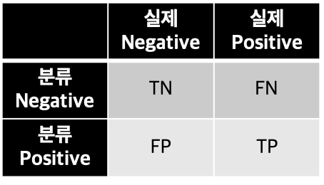
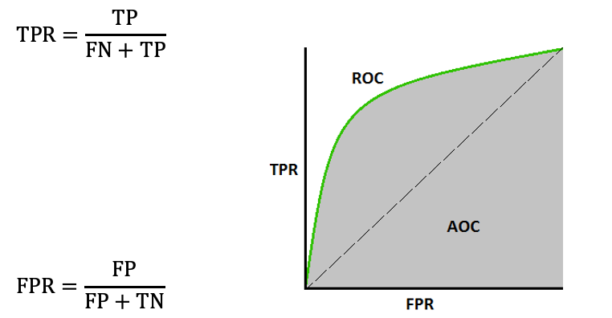

## 2. 모형 평가

### 회귀 모형의 평가
|평가 지표|수식|설명|
|-------|---|---|
|MAE(Mean Absolute Error)|||
|MSE(Mean Square Error) or RMSE(Root MSE)||오차의 크기가 클수록 제곱으로 커짐|
|MAPE(Mean Absolute Percentage Error)||관측된 값 대비 오차의 비율을 계산 값 보다 상대적인 크기가 중요한 경우 사용|
|SMAPE(Symmetric MAPE)||MAPE에 대칭성을 부여|
|Predicted R Square||모든 값을 평균으로 예측하는 베이스 모델의 MSE와 대상인 모델의 MSE를 비교|
|설명분산점수||브라이틱스에서 사용하는 지표로 Predicted R Square에서 편향성까지 확인 편향되지 않았다면 Predicted R Square와 동일.|

### 분류 모형의 평가
|평가 지표|수식|설명|
|-------|---|---|
|Confusion Matrix||예측과 실제의 교차 테이블|
|Accuracy||맞은 것은 맞다고 틀린 것은 틀리다고 잘 분류한 비율|
|Precision||맞다고 분류한 것 중 진짜 맞은 것의 비율|
|Recall||진짜 맞은 것 중 맞다고 분류한 비율|
|F1 Score||Precision과 Recall을 동시에 고려한 지표|
|Cross Entropy Loss||분류 확률까지 고려한 지표|
|AUROC(Area Under ROC)||False Positive Rate에서 True Positive Rate의 비율|

### AUROC
- ROC 커브의 면적
- 0~1 사이의 값으로 베이스라인은 0.5이다
  - 0.5보다 낮으면 분류의 결과과 정반대로 이루어지고 있음을 의미한다
- X 축은 FPR을 Y 축은 TPR을 의미한다.
  - FPR: 실제로 아닌 것 중에 맞다고 분류한 비율
  - TRP: 실제로 맞은 것 중에 맞다고 분류한 비율 (Recall)