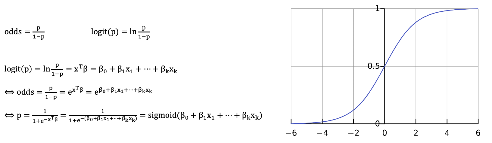

## 분류

### 로지스틱 회귀
- 종속변수가 범주형 변수인 회귀식
- 범주형 변수에 속할 확률 p라고 할 때, p에 대한 로짓(logit)이 설명변수(x)와 선형이라고 가정한다
  - 오드(odds): p일 확률과 p가 아닐 확률의 비율
  - 로짓(logit): 오드의 자연로그를 취한 값
- 식을 정리하면 확률 p에 대한 로지스틱 함수가 나온다.
  - 로지스틱 함수는 시그모이드 함수(S 곡선을 가지는 함수)의 일종이다

    

### 소트프맥스 회귀
- 종속변수의 범주 개수가 3개 이상인 다항 클래스 문제를 해결하는 방법
- 로지스틱 함수를 사용하는 대신에 소프트맥스 함수를 사용하여서 클래스에 속할 확률을 계산
  - 소프트맥스함 함수는 0과 1 사이의 확률로 표준화하는 역할을 한다

    

### 나이브 베이즈 분류
- 베이즈 정리를 기반의 확률 모형 분류기
- 범주형 설명변수를 사용하는 분류 모형에 적합하여 자연어처리에서 활용
- 베이즈 정리에 근거하여서 사후 확률을 사전 확률로 추정한다.
  - 사전 확률은 데이터를 통해 계산할 수 있다
  - 확률의 곱셈을 위해서 설명변수간의 독립을 가정한다
- 학습 데이터의 성격에 따라서 변형한다
  - 라플라스 스무딩: 클래스에 해당하는 학습 데이터가 없는 경우 확률이 0이 되는 것을 방지하고자 빈돌르 +1 하는 방법
  - 언더 플로우 방지: 클래스가 많아지면서 값이 작아지는 것을 방지하기 위해 log 곱를 곱한다
  - 확률 분포 활용: 데이터의 확률 분포에 따라서 가우시안, 다항분포, 베르누이 분포의 특성을 나이브 베이즈에 반영한다

    

--

## Quiz
1. 다음 중 분류(Classification) 모형이 아닌 것은?
   1. 로지스틱 회귀(logistic regression)
   2. 서포트 벡터 머신(support vector machine, svm)
   3. 선형회귀(linear regression) (X)
   4. 나이브 베이즈(niave bayes)
2. 다음 중 분류(classification) 방법에 대한 설명으로 적절하지 않은 것은?
   1. 정답(label)이 필요한 지도학습이다 (O)
   2. 분류 성능을 평가할 수 있는 평가 함수가 모형 내부에 포함되어 있다 (O)
   3. 선형(linear) 모형이 아닌 경우도 분류가 가능하다 (O)
   4. 두 개를 넘는 카테고리 변수는 분류 모형으로 처리가 어렵다 (X, 다중 분류 모델로 가능)
3. 로지스틱 회귀(logistic regression) 분석에서 사용하는 시그모이드(sigmoid) 함수에 대한 설명으로 옳은 것은?
   1. 시그모이드 함수를 ㅌ오과한 입력은 -1에서 1사이 값으로 수렴한다. (X, 0과 1사이 값으로 수렴한다)
   2. 시그모이드 함수는 S자 형의 커브를 가지며, 극 값을 안정화 시키는 효과를 낼 수 있다. (O)
   3. 시그모이드 함수를 이용하여 비선형(non-linear) 문제를 해결할 수 있다. (X, ReLU 권장)
   4. 시그모이드 함수는 제한적으로 딥러닝과 같은 모형에서는 사용하기 어렵다. (X, 사용 가능)
4. 나이브 베이즈(naive bayes) 분류가에 대한 설명으로 옳지 않은 것은?
   1. 확률 이론인 베이즈 정리(bayes theorem)을 기반으로 하고 있다 (O)
   2. 데이터의 분포에 따라 가우시안, 다항 분포, 베르누이 분포 등의 특성을 적용할 수 있다 (O)
   3. 연속형 데이터 분류에 적합하여, 범주형 데이터에 사용하는 경우는 별로 없다 (X, 범주형 데이터 분류에 활용하여 자연어처리에 좋은 성능 보임)
   4. 나이브 베이즈 모형은 학습 시 확률 값 계산을 기반으로 하기 때문에, 데이터의 양이 커져도 처리가 가능한 경우가 많다 (O)
