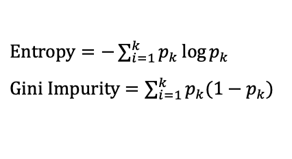
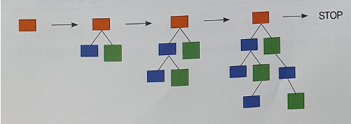
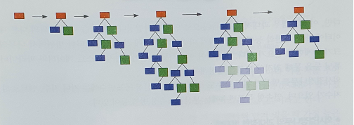

## 회귀 및 분류

### KNN
- 새로운 데이터와 가까운 k개의 이웃을 보고 다수결로 클래스 결정
- 적합한 k는 실험을 통해 확인
  - 작은 k: 이상치에 영향을 많이 받음
  - 큰 k: 둔감한 분류기
- 이웃을 판정하는 데는 민코우스키 거리를 사용한다
  - 특히 p=2인 유클리디언 거리를 사용
- KNN에서 각 특징(feature)는 스케일이 다르기 때문에 정규화가 필요하다

### SVM
- SVM은 데이터를 구분하는 초평면을 찾는 분류기이다
  - 초평면은 마진을 최대화해야한다
  - 마진은 초평면과 서포트 벡터 사이의 거리를 의미한다
  - 서포트 벡터는 초평에 가장 가까이에 있는 클래스 경계 데이터를 의미한다
- SVM에서 오분류를 허용하는 소프트 마진으로 예측력을 높일 수 있다
  - 하드 마진은 오분류를 허용하지 않으므로 학습 데이터에 과적합된다
- 비선형 데이터를 분류하기 위해서 커널 트릭을 사용한다
  - 원래의 데이털르 커널 함수를 사용해서 선형 변환을 시킨다
  - 커널 함수는 원래의 공간에서는 선형 분리가 불가능한 데이터를 선형 분류가 가능한 공간으로 사상한다

### Decision Tree
- 연속적인 질문의 노드를 통해서 분류하는 모델
- 노드로 분기할 때에는 불순도가 떨어지는 변수(와 기준값)를 선택한다
  - 분기되기 전의 불순도가 분기된 이후의 불순도 합보다 커야한다
  - 불순도의 지표로는 엔트로피와 지니 계수를 사용한다

    

- Decision Tree를 끝까지 확장하면 불순도가 0이 된다 = 모든 데이터를 정확한 클래스에 분류한다
  - 하지만 이러한 경우 학습 데이터에 대한 과대적합으로 예측력이 떨어질 수 있다
- 학습 데이터 과적합을 방지하기 위해서 정지규칙(stopping)을 만들거나 가지치기(pruning)을 한다
  1. 정지규칙(stopping)
     - 모든 데이터가 하나의 클래스로 분류되면 더 이상 분기하지 않는다
     - 트리의 깊이가 일정 수준을 넘어가면 분기하지 않는다
     - 한 노드에 포함된 데이터의 개수가 적으면 분기하지 않는다
     - 불순도가 줄어드는 정도가 크지 않으면 분기하지 않는다

  2. 가지치기(pruning)
     - 불순도 0의 Decision Tree를 구축한다
     - 분류 오류를 크게 할 위험이 있거나 부적절한 추론 규칙을 가진 경우 가지 치기를 통해 분기를 없앤다 

### 배깅(bootstrap aggregating, bagging) - Random Forest
- 앙상블(ensemble) 방법 중 하나로 다수의 약한 예측기/분류기의 투표 결과로 최종 예측/분류
  - 약한 모델을 다수 만드는 것은 데이터의 다양성을 표현하는 좋은 방법이다
- 랜덤 포레스트는 대표적인 배깅 모델로 다수의 Decision Tree를 결합한다
  - row subsampling: 개별 Decision Tree는 전체 데이터 중 새플링된 일부 데이터를 사용해서 구축한다
  - column subsampling: 개별 Decision Tree는 전체 특징 중 샘플링된 일부 특징을 사용해서 구축한다. 더 다양한 모델을 만들어서 결합하였을 때 성능을 높일 수 있다
- 종속변수를 결정하는데 큰 역할을 하는 독립변수는 특성 중요도(feature importance)에 근거하여서 판단한다
  - 랜덤 포레스트의 각 Decision Tree에서 독립변수로 인해 불순도가 얼마나 떨어지는지 정량화한다 (루트 노드에 가까울 수록 불순도를 많이 떨어뜨리는 중요한 독립변수이다)
  - Leave-One-Out 방식으로 모든 독립변수를 포함한 모델의 예측력과 특정 독립변수를 제외한 모델의 예측력 차이를 비교한다.

### 부스팅(boosting)
- 앙상블(ensemble) 방법 중 하나로 모델을 결합할 때 예측이 틀린 데이터에 높은 비중을 두어서 학습시킨 약한 예측기를 사용한다
  - 약한 예측기 A를 학습한다
  - 약한 예측기 A의 예측이 틀린 데이터에 높은 가중치를 두고 약한 예측기 B를 학습한다
  - 위의 과정으로 다수의 약한 예측기를 만들고 최종 결합한다
- 부스팅은 성격상 다수의 약한 예측기를 병렬적으로 구축하는 것이 불가능하기 때문에 성능은 좋지만 느린 방법이다.
  - 트리로 부스팅을 구현하는 경우 분기점을 빠르게 찾기 위한 알고리즘으로 약간의 성능을 개선한다
- 부스팅은 가중치를 이용하는 방법과 잔차를 이용하는 방법으로 구분한다
  1. 가중치를 이용하는 부스팅 - AdaBoost, LogitBoost
     - 모델 A가 예측한 값과 실제 값의 오차 절댓값을 구한다
     - 후속 모델 B를 학습할 때에 오차 절댓값의 가중치가 데이터에 반영된다
     - 만약 가중치가 2라면, 이는 해당 데이터를 2번 사용하는 것과 같은 효과를 보인다. (높은 가중치 = 모델이 해당 데이터를 잘 예측할 가능성을 높임)
  2. 잔차를 이용하는 부스팅 - GradientBoost, DARTBoost
     - 모델 A가 예측한 값과 실제 값의 오차(절댓값 X)를 구한다.
     - 후속 모델 B는 오차를 예측하도록 학습한다.
     - 모델 A와 후속 모델 B를 결합해서 최종 예측 결과를 산춣한다

---

## Quiz
1. 테스트(test) 데이터와 가까운 K개의 학습(train) 데이터의 label 값들을 비교하여 가장 많은 class로 예측한느 classification 방법은 무엇인가
   1. k-means
   2. k-nearest neighbors (O)
   3. gaussian mixture
   4. k-fold cross validation
2. SVM(support vector machine) 분류기를 학습할 때 사용되는 주요 개념이 아닌 것은?
   1. entropy: 데이터가 얼마나 순수한지, 불순한지를 평가 (X, Decision Tree)
   2. support vectors: 경계에 가장 가까운 점들 (O)
   3. margin: 양쪽 경계 점 사이의 거리 (O)
   4. hyperplane: 두 라벨 데이터를 구분하는 초평면 (O)
3. 다음 중 커널 기법(kernel trick)에 대한 설명으로 잘못된 것을 고르시오
   1. 선형 모형에 적용하여 비선형 모델링이 가능하게 해준다 (O)
   2. 기존의 데이터를 새로운 공간으로 매핑한다 (O)
   3. 선형 커널, 다항 커널, RBF 커널, 시그모이드 커널 등 다양한 커널 함수가 있다 (O)
   4. 많이 사용되는 RBF 커널은 범주형 변수를 처리하는 데 사용된다. (X, RBF는 지수 항에 붙어서 연속형 변수를 처리한다)
4. 다음 중 KNN의 설명 중 틀린 것은?
   1. 데이터들 간의 거리 계산이 필요하다 (O)
   2. 주변의 K개의 데이터를 살펴보고 대상 데이터로 분류한다 (O)
   3. 미리 학습하여 모델을 만들 필요가 없이, 기존 데이터들을 메모리로 올리는 작업만 필요하다(O)
   4. 계속적인 iteration을 통해 점들의 중앙을 계산하며, 대상 데이터를 제일 가까운 군집으로 분류한다. (X, 군집화 방법)
   5. K가 라벨 데이터와 개수가 같은 경우, 데이터 전체의 다수결 푸툐로 대상 데이터가 분류된다. (O) 
5. 다음 중 KNN의 거리 계산 알고리즘에 대한 설명으로 틀린 것은?
   1. 차원이 늘어날 경우 거리 계산 컴퓨팅 속도가 중요하다 (O)
   2. KD Tree는 이진 트리를 만들어 빠르게 거리 계산이 필요 없는 데이터들을 계산 대상에서 빼버린다 (O)
   3. Tree류의 알고리즘이 Brute-force보다 항상 우세하다 (O)
   4. KD Tree는 Ball Tree보다 고차원에서 항상 빠른 속도를 보장한다 (X, 고차원 데이터는 Ball Tree가 사용된다)
   5. Ball Tree에서 하나의 데이터는 하나의 Ball에 속할 수 있다. (O)
6. 의사결정나무에 대한 설명으로 옳은 것은?
   1. 의사결정나무는 블랙박스 모델로서, 예측력은 뛰어나지만, 모델이 어떤 식으로 구성되어 있는지 알기 힘들다. (X, 모델의 분기점 확인 가능)
   2. 의사결정나무에서는 Entropy를 계산함으로써, 리프노드의 Impurity를 계속 낮추는 방법을 택한다. (O)
   3. 의사결정나무 분류모델은 Gini 계수를 제일 급격하게 높이는 리프노드를 평균해서 분기한다. (X, Gini 계수를 낮추어야 한다)
   4. ID3 의사결정나무는 2개 이상의 분기노드를 사용하지만, 분류 분석이 되지 않는다. (X, 분류 분석 가능)
   5. CART 의사결정나무는 수치형 데이터를 예측하는 회귀의사결정나무를 지원하며, 분류는 지원하지 않는다. (X, 분류 지워)
7. 부스팅에 대한 설명으로 옳지 않은 것은?
   1. 부스팅은 모델을 계속 발전시켜 나가면서 개선을 하는 방법이다. (O)
   2. 대표적인 부스팅 방법은 gradient boosted decision tree가 있다 (O)
   3. Adaboost는 잔차를 이용한 부스팅 방법으로서, 병렬처리로 트리를 동시에 만들기 때문에 빠르다. (X, Adaboost는 가중치 이용 부스팅이다)
   4. 부스팅은 2019년 현재 기준 경쟁대회에서 예측률이 제일 상회하는 알고리즘 중 하나이다. (O)
   5. 학습률(shrinkage)을 높게 두면 오히려 학습이 안되는 결과가 생긴다. (O)
8. 랜덤포레스트에 대한 설명으로 옳은 것은?
   1. 의사결정나무를 이용하기 때문에 직관적으로 모델을 이용가능하며 설명력이 굉장히 높다 (X, 의사결정나무 자체는 설명력이 낮다)
   2. 수천 개의 트리를 만들어서 투표하여 이중 제일 투표를 많이 받은 단일 트리로 선택한다 (X, 모든 트리가 결정에 사용됨)
   3. 모든 변수들을 선택한 후, 배깅 방법을 통하여 데이터의 일부만 선택하여 학습한다. (X, column subsampling이 가능하다)
   4. 특성 중요도가 도출되기 때문에 어떤 변수가 제일 영향력이 높은지 확인이 가능하며 EDA로도 사용 가능하다 (O)
   5. 랜덤하게 의사결정나무를 선택하기 때문에 예측률은 단일 트리에 비해 낮지만 안정성이 뛰어나다(X, 예측률이 단일 트리보다 높다)
9.  다음 잠실 향균타워 점심메뉴를 예측하는 의사결정나무에서 리프노드에 대한 엔트로피를 계산하고자 한다. 다음 리프노드의 엔드로피는? (쌀국수, 쌀국수, 쌀국수, 쌀국수, 쌀국수, 피자, 피자, 피자)
   - 쌀국수: 5 피자: 3
   - (-5/8\*log(5/8)) + (-3/8\*log(3/8)) = 0.9544