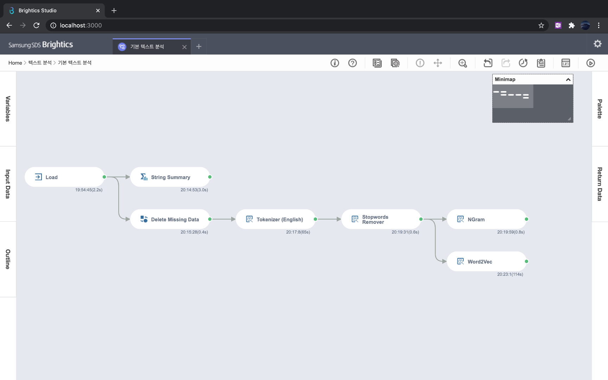
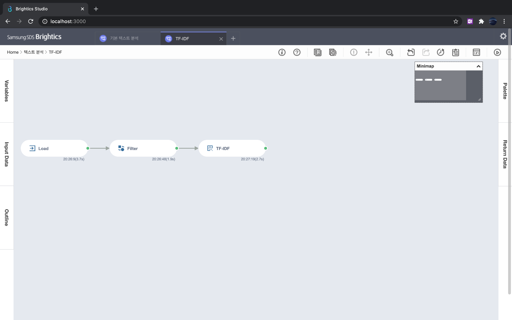
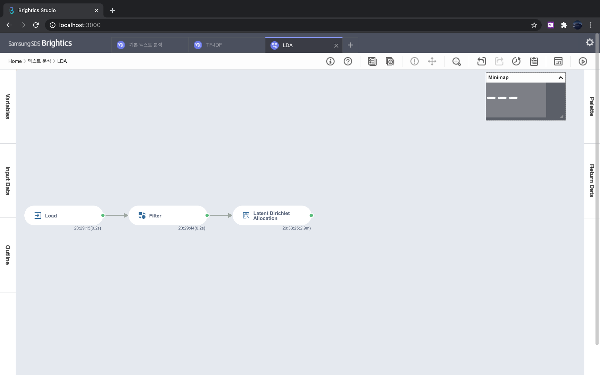

## 5. 추가 주제 
-----

### [1. 텍스트 분석](notes/텍스트%20분석.md)
- 텍스트 전처리 방법은 1) 불용어 제거 2) 유의어 처리 3) 복합어 처리 4) 토큰화 5) 형태소 분석이 있다
- 텍스트를 수치로 표현하기 위한 방법으로는 1) BoW 2) TF-IDF가 대표적이다
- 토픽 모델링은 문헌이 가지는 토픽을 파악하기 위한 방법으로 LDA(Latent Dirichlet Allocation)과 같은 확률적 방법론을 활용한다.

|[실습파일: 기본 텍스트 분석](기본%20텍스트%20분석.json)|[실습 파일: TF-IDF](TF-IDF.json)|[실습 파일: LDA](LDA.json)|
|-|-|-|
||||

