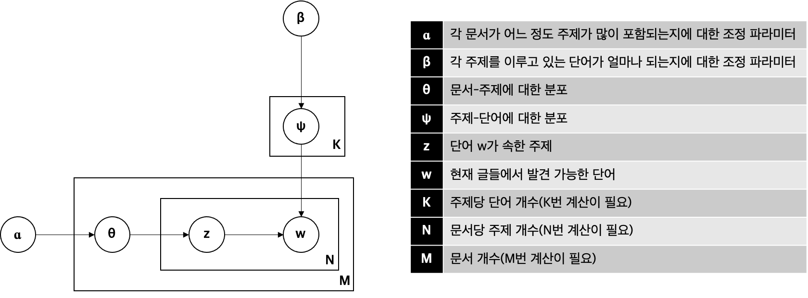

## 텍스트 분석

## ☕️ Recall

1. 텍스트 전처리를 위한 방법은 무엇이 있나요?
2. 텍스트를 표현하는 BoW는 무엇인가요?
3. Bow로 텍스트를 포현하는 단점은 무엇인가요?
4. N-Gram을 텍스트 분석에 활용하는 이유는 무엇인가요?
5. TF-IDF에서 문헌과 단어를 어떻게 수치적으로 표현하나요?
6. TF 공식과 IDF 공식은 무엇인가요?
7. TF-IDF 사용할 떄의 주의할 점은 무엇인가요?
8. 토픽 모델링, LDA, 깁스 샘플링의 관계는 무엇인가요?
9. LDA에서 사용하는 확률 분포와 그 의의는 무엇인가요?
10. 베타 분포와 디리클레 분포의 관계는 무엇인가요?

---

### 텍스트 전처리

1. 불용어 처리: 관용적으로 등장하는 단어들이나 be 동사는 불용어로 처리하고 제거한다
2. 유의어 처리: 유의어는 하나의 대표어로 치환한다
3. 복합어 처리: 복합어는 두 단어 이상으로 구성되어 있지만 하나의 단어로 간주한다
4. 토큰화: (영어) 공백을 기준으로 토큰화하면 일반적으로 성공적이다.
5. 형태소 분석: 의미를 가진 최소의 단위로서 형태소를 구하고 필요없는 조사나 어미를 제거한다

### Bag of Words

- 텍스트를 Term-Document Matrix로 표현하는 방법
- Document에 Term이 포함된 빈도(또는 포함 여부)를 행렬로 구축한다
- Term-Document Matirx는 대부분의 값이 0인 희소행렬이다
- 문맥이 잘 드러나지 않는다
    - '물 냉면이 맛있다'와 '냉면이 물 맛이다'는 형태소를 Term으로 하는 경우 동일한 BoW를 가진다

### N-Gram

- 하나의 단어만을 대상으로 분석하는 것이 아니라 문맥을 고려하기 위해 N개의 연속적인 단어를 그룹화해서 분석하는 방법
- 문맥(context)가 주어졌을 때 조건부 확률을 구함으로써 문맥에 가장 잘 맞는 단어가 무엇인지 판단한다.

$$P(w_1,w_2,w_3, ..., w_n) = P(w_1) \prod_{i=k}^{n}P(w_i|w_{i-k})$$

### TF-IDF

- 문헌 내의 단어 빈도와 역문헌 빈도를 고려하여서 문헌과 단어의 TF-IDF 값을 구한다
- 단어 빈도는 높지만 문헌 빈도는 낮은 단어가 높은 TF-IDF를 가진다.
    - 단어가 특정 문헌에 집중적으로 사용되었음을 의미하며, 특정 문헌에서 단어가 주요한 역할을 한다고 간주한다
- TF-IDF는 TF 값과 IDF 값을 곱해서 계산한다

$$\text{TF-IDF}(t,d) = \text{TF}(t,d)\times \text{IDF}(t)$$

**✔︎ 단어 빈도 계산하기: TF(t, d)**

1. 단순 빈도: 문헌 d에 등장하는 단어 t의 빈도를 센다
2. 불리언 빈도: 문헌 d에 단어 t가 등장하면 1이고 등장하지 않으면 0이다
3. 로그 스케일 빈도: 문헌 d에 등장하는 단어 t의 빈도에 로그를 적용한다. $log(tf+1)$
4. 증가 빈도: 문헌 d의 TF 값이 1이 넘지 않도록 정규화한다. 단어 빈도의 최댓값으로 나눈다. 

**✔︎ 역문헌 빈도 계산하기: IDF(t)**

- 단어 t가 등장하는 문헌의 개수를 계산한다 (DF)
- 역문헌 빈도는 전체 문헌의 개수를 DF로 나누고 로그를 취한 값이다 $\text{IDF}(t) = log(\text{N} / \text{DF}(t))$

### TF-IDF 사용시 주의 사항

- 문헌의 길이가 다름에 따라서 TF-IDF 값이 영향을 받을 수 있다
- 불용어 제거 작업이 필요하다

### LDA와 토픽 모델링

- 토픽 모델링의 주요 가정은 하나의 문헌은 다수의 토픽으로 구성하며, 토픽은 단어들로 구성한다
- 토픽 모델링의 목표는 단어들이 어떠한 토픽에 속하는지를 파악해서 문헌의 토픽을 파악하는 것이다
- LDA는 토픽 모델링을 위한 방법으로 문서-토픽 간 분포와 토픽-단어 간 분포가 디리클레 분포를 따른다는 것을 이용하여서 문서-토픽-단어의 관계를 확률적으로 설명하는 모델이다
- LDA 토픽 모델링을 통해 모델을 학습하는 과정에서 z 값을 구하기 위해 깁스 샘플링이 활용된다

**✔︎ 베타 분포와 디리클레 분포**

- 베타 분포와 디리클레 분포 모두 사전 정보에 따라서 어떠한 선택지가 결정될 확률에 대한 확률 분포이다
- 베타 분포는 선택지가 두 개일 때의 확률 분포이다
- 디리클레 분포는 베타 분포의 일반항으로 선택지가 다수 일 때 어떠한 선택지에 속할지 결정한다

**✔︎ 깁스 샘플링**

- 깁스 샘플링은 마로프체인 몬테카를로(Markov Chaing Monte Carlo, MCMC)의 한 종류이다
    - 베이지안 추론에 활용되는 알고리즘이다
- 깁스 샘플링을 통해 단어(w)가 어떠한 토픽(z)에 속하는지 결정한다
    - 초기에 모든 단어에 대해서 임의로 토픽을 할당한다
    - 단어를 하나씩 순회하면서, 해당 단어를 제외한 나머지 단어-주제 정보를 활용하여서 해당 단어의 주제를 갱신한다
    - 나머지 단어를 보고 해당 단어가 어떠한 토픽에 많이 사용되었는지, 또 단어가 속한 문헌에는 어떠한 토픽이 많이 할당되었는지를 보고 결정한다

---

## Quiz

1. 다음 중 텍스트 분석에 대한 특징이 아닌 것은?
    1. 한글의 경우 분석의 단위에 맞게 단어를 끊어내는 일이 영어에 비해 난이도가 높고 중요하다. (O, 한글은 형태소가 영어에 비해 복잡하다)
    2. 한글의 경우 여러 가지 인코딩 방식이 있기 때문에 이를 주의해야 하며, 대부분 최근에는 3바이트의 UTF-8 방식으로 인코딩되어 있다. (O)
    3. 규칙적인 텍스트들을 쉽게 찾기 위한 규칙을 정규식이라 한다. (O)
    4. 불용어는 평범하게 쓰지는 않는 단어이기 때문에 글만의 주제를 파악하는 데 중요한 역할을 하며, 워드 클라우드로 시각화할 때 꼭 필요하다. (X, 불용어는 제거한다)
    5. 단어에 대한 빈도를 구름 형태로 시각화한 것을 워드 클라우드라 한다. (O)
2. 텍스트 분석 트렌드에 대한 설명이다. 이에 틀린 것을 고르시오.
    1. word2vec과 같은 알고리즘으로 단어를 벡터화를 한 후, 벡터화된 데이터를 가지고 GRU, LSTM 등의 알고리즘을 이용해서 분석을 할 수 있다. (O)
    2. doc2vec을 이용하면 문장당 동일한 길의의 벡터를 얻어낼 수 있다. (O)
    3. 텍스트 분석은 인간의 언어를 이해하는데 있어 필수적으로, 계속적으로 연구가 많이 이뤄지고 있는 분야이다(O)
    4. 텍스트 분석은 영상인식과는 다르게 변수가 특정 지어지지 않기 때문에 Recurrent Neural Network 등을 이용할 수는 없으며, 맥락을 처리하기 위해 Context Based Time Series Auto Regressive와 같은 알고리즘이 주로 쓰인다. (X, 텍스트 분석에서 RNN이 사용된다. 대표적으로 seq2seq을 활용한 기계 번역이 있다)
    5. 중국어와 같이 띄어쓰기가 없으며 글자가 의미를 가지는 언어에 대해서도 연구가 활발하게 진행되고 있다. (O)
3. LDA(Latent Dirichlet Allocation)에 대한 설명으로 틀린 것은?
    1. 주 구성요소는 Document(문서)-Topic(주제)-Word(단어)이다.(O)
    2. 디리클레 분포에 의해 주제별 단어 할당이 영향을 받는다. (X, 단어 별 주제 할당이 영향을 받는다)
    3. 베타분포는 디리클레 분포의 일반화 버전이며, 데이터가 많다고 하더라도 초기값에 따라 편차가 매우 크다. (O)
    4. 일종의 반복적 시뮬레이션 방법인 깁스 샘플링 방법을 이용한다. (O)
    5. 사용자에게 눈에 보이는 단어와 이를 잠재적으로 구성하는 구조가 있다는 것이 LDA의 핵심이다. (O)
4. N-gram에 대해서 설명이 틀린 것을 모두 고른 것은?
    1. 단어를 하나의 통에 담는 방법에 대한 방법론이다. (O)
    2. 한 개를 담을 시 unigram, 두 개를 담을 시 bigram이다. (O)
    3. 많은 단어들을 한 통에 담을수록 단어 앞뒤의 맥락을 잃어버리게 된다. (X, 많이 담을 수록 맥락을 더 고려한다)
    4. bigram의 원리만으로도 이후에 오는 품사를 예측해 볼 수 있다. (O)
    5. N-gram에서 n이 높아질수록 예측력은 하락하는 면이 있다. (X, 일반적으로 연산량이 늘어나면서 예측력이 상승한다)
5. 다음 문장에 대한 bigram을 도출하시오. - Do you kwow Kimchi
    - (Do you), (you know), (know Kimchi)
6. 다음 글에 대한 Term-Document Matrix를 완성하시오.  
문서 1: Do you know Kimchi? I know you love Kimchi.  
문서 2: Do you know Psy? I do love Psy.  
문서 3: You know machine learning.

||do|you|know|kimchi|psy|love|me|machine|learning|I|
|-|-|---|----|------|---|----|--|-------|--------|-|
|doc 1|1|2|2|2||1||||1|
|doc 2|2|1|1||2|1||||1|
|doc 3||1|1|||||1|1||

7. 위 문제에 이어서 문서1에 등장하는 단어 Do, you, know, Kimchi의 TF(단어빈도)와 IDF를 도출하고 도출한 TF-IDF에 따라 주제(대표 단어)를 선택하시오.

||do|you|know|kimchi|
|-|--|--|----|------|
|TF|1|2|2|2|
|IDF|log(3/2)|log(3/3)|log(3/3)|log(3/1)|
|TF-IDF|log(3/2)|0|0|2 log(3)|
